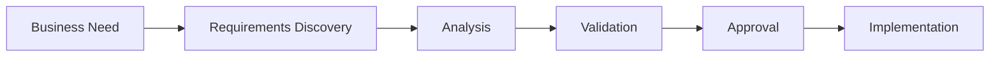
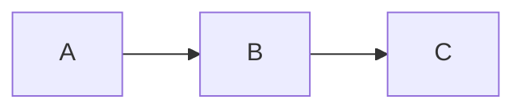
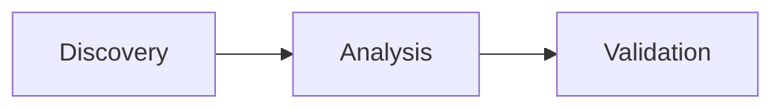

# Engineering Documentation Style Guide

## Overview

Engineering documentation is a strategic asset that captures organisational knowledge, communicates engineering decisions, establishes common practices, and enables the consistent delivery of high-quality software systems. Well-structured documentation reduces ambiguity, accelerates onboarding, improves collaboration, supports governance, and preserves critical knowledge throughout the software lifecycle.

The Engineering Documentation Style Guide defines the writing standards, formatting conventions, and communication principles adopted by the Invara Labs Engineering Operating System (ILOS). It provides a consistent approach for creating engineering documentation that is clear, accurate, maintainable, accessible, and suitable for both human readers and AI-assisted workflows.

This standard applies to all engineering documentation regardless of domain, technology stack, or intended audience. Whether documenting engineering principles, playbooks, standards, architecture, APIs, operational procedures, design decisions, or technical references, authors shall follow the guidance defined in this document to ensure consistency across the organisation.

The style guide extends beyond grammar and formatting. It establishes how engineering knowledge should be organised, communicated, reviewed, and maintained over time. By standardising language, terminology, document structure, visual presentation, and cross-referencing, it creates a unified documentation experience that enables engineers to locate information quickly, understand it efficiently, and apply it consistently.

As the authoritative documentation standard for ILOS, this guide supports engineering excellence by promoting high-quality technical communication, improving documentation maintainability, facilitating collaboration across teams, and providing a scalable foundation for long-term knowledge management and governance.

# Purpose

The purpose of the Engineering Documentation Style Guide is to establish a common standard for creating, maintaining, and evolving engineering documentation across the Invara Labs Engineering Operating System (ILOS). It defines how engineering knowledge should be communicated to ensure that documentation is clear, consistent, accurate, maintainable, and accessible throughout its lifecycle.

Engineering documentation serves as a primary mechanism for sharing knowledge, recording decisions, standardising engineering practices, and enabling collaboration across teams. Without a consistent writing standard, documentation gradually becomes fragmented, inconsistent, difficult to navigate, and challenging to maintain. This guide addresses those challenges by providing a unified approach to documentation authoring that can be applied across all engineering disciplines.

The objectives of this standard are to:

- Establish a consistent writing style across all engineering documentation.
- Standardise document structure, formatting, terminology, and presentation.
- Improve readability and comprehension for engineers, architects, technical writers, and other stakeholders.
- Reduce ambiguity and improve the accuracy of technical communication.
- Support long-term maintainability through consistent organisation and governance.
- Enable effective knowledge sharing across teams, projects, and products.
- Improve discoverability by applying predictable document structures and naming conventions.
- Support AI-assisted documentation by promoting structured, machine-readable, and well-organised content.
- Ensure engineering documentation remains scalable as the organisation and documentation repository continue to grow.

This guide applies to all engineering documents produced within ILOS, including principles, playbooks, standards, architecture documentation, API specifications, design documents, technical references, operational procedures, Architecture Decision Records (ADRs), Request for Comments (RFCs), and other engineering artefacts. It provides a single, authoritative writing standard that promotes consistency across every document regardless of its domain or audience.

By adopting this standard, engineering teams can communicate more effectively, reduce documentation inconsistencies, improve collaboration, and create a sustainable engineering knowledge base that supports both current development activities and future organisational growth.

# Objectives

The Engineering Documentation Style Guide establishes the objectives that govern the creation, maintenance, and continuous improvement of engineering documentation within the Invara Labs Engineering Operating System (ILOS). These objectives provide a common direction for authors, reviewers, and maintainers, ensuring that every engineering document contributes to a consistent, high-quality knowledge ecosystem.

The objectives of this standard are to:

## DO-001 Promote Clarity

Ensure engineering documentation communicates ideas clearly, accurately, and without unnecessary complexity. Readers should be able to understand the intended message without ambiguity or interpretation.

---

## DO-002 Ensure Consistency

Standardise writing style, terminology, document structure, formatting, and presentation across all engineering documentation to create a predictable and professional reading experience.

---

## DO-003 Improve Readability

Organise information using logical structures, meaningful headings, concise language, visual hierarchy, and supporting examples so that readers can quickly locate and understand relevant information.

---

## DO-004 Enable Knowledge Sharing

Facilitate effective communication of engineering knowledge across teams, disciplines, products, and organisational boundaries by using common documentation practices.

---

## DO-005 Support Maintainability

Create documentation that can be easily reviewed, updated, versioned, and maintained as systems, technologies, and engineering practices evolve.

---

## DO-006 Improve Discoverability

Encourage consistent naming conventions, metadata, cross-references, and document organisation to make engineering knowledge easy to locate and navigate.

---

## DO-007 Establish Documentation Quality

Define measurable standards for documentation quality, enabling engineering teams to review documents objectively and maintain consistent quality across the repository.

---

## DO-008 Support Engineering Governance

Provide a documentation framework that supports review processes, ownership, approvals, traceability, version control, and lifecycle management.

---

## DO-009 Enable AI-Assisted Documentation

Promote documentation structures and writing practices that improve the effectiveness of AI-assisted authoring, summarisation, search, analysis, and knowledge retrieval while ensuring that human authors remain accountable for technical accuracy.

---

## DO-010 Build a Sustainable Engineering Knowledge Base

Establish documentation practices that preserve organisational knowledge, reduce duplication, encourage reuse, and support the long-term evolution of the Engineering Operating System.

---

Collectively, these objectives establish the expectations for engineering documentation within ILOS. Every engineering document should contribute to one or more of these objectives, ensuring that documentation remains a reliable, scalable, and valuable engineering asset throughout its lifecycle.

# Scope

The Engineering Documentation Style Guide defines the writing, formatting, and presentation standards for engineering documentation produced within the Invara Labs Engineering Operating System (ILOS). It establishes a consistent approach for communicating engineering knowledge while ensuring documentation remains clear, maintainable, accessible, and professionally presented.

This standard applies to all engineering documentation created, maintained, or reviewed within the organisation, regardless of technology stack, engineering discipline, or intended audience.

## In Scope

The guidance defined in this standard applies to the creation and maintenance of, but is not limited to, the following document types:

- Engineering Principles
- Engineering Playbooks
- Engineering Standards
- Architecture Decision Records (ADRs)
- Request for Comments (RFCs)
- Software Architecture Documents
- API Specifications
- Technical Design Documents
- Engineering Proposals
- Operational Runbooks
- Incident Reports
- Postmortems
- Technical Reference Documentation
- Engineering READMEs
- User Guides
- Developer Guides
- Knowledge Base Articles

For these documents, this standard governs:

- Writing style
- Language usage
- Grammar and terminology
- Document structure
- Section hierarchy
- Formatting conventions
- Markdown usage
- Naming conventions
- Tables, diagrams, and code examples
- Cross-referencing
- Documentation accessibility
- Documentation consistency

---

## Out of Scope

This standard does not define engineering processes, technical implementation guidance, or organisational governance beyond documentation style.

The following topics are governed by other standards or playbooks within ILOS:

- Engineering methodologies and workflows
- Software architecture practices
- Requirements Engineering processes
- API design standards
- Coding standards
- Security policies
- DevOps practices
- Testing methodologies
- Project management processes
- Product management practices

Similarly, this standard does not prescribe:

- Programming language conventions
- Technology selection
- Framework-specific guidance
- Business processes
- Legal or regulatory requirements
- Product documentation intended for external customers unless explicitly adopted by those teams

---

## Intended Audience

This standard is intended for all individuals who create, review, approve, or maintain engineering documentation, including:

- Software Engineers
- Solution Architects
- Technical Leads
- Engineering Managers
- Product Managers
- Business Analysts
- Quality Engineers
- DevOps Engineers
- Platform Engineers
- Site Reliability Engineers
- Technical Writers
- Engineering Governance Teams
- AI-assisted documentation authors operating under human review

---

## Applicability

The Engineering Documentation Style Guide applies throughout the complete documentation lifecycle, including:

- Creating new documentation
- Updating existing documentation
- Reviewing documentation
- Publishing documentation
- Versioning documentation
- Maintaining documentation
- Retiring obsolete documentation

Every engineering document should comply with this standard unless an approved exception has been granted through the Engineering Governance process.

---

## Relationship to Other Standards

This document defines **how engineering documentation is written**.

It complements, but does not replace, other standards within ILOS.

For example:

| Standard | Primary Responsibility |
|----------|-------------------------|
| PB-AUTHORING | Defines the mandatory structure of Engineering Playbooks |
| DOC-STYLE | Defines how engineering documentation is written and presented |
| TERM-STANDARD | Defines approved engineering terminology and vocabulary |
| DOC-GOVERNANCE | Defines document ownership, reviews, approvals, and lifecycle management |

Together, these standards establish a comprehensive framework for creating, managing, and maintaining high-quality engineering documentation across the organisation.

# Documentation Philosophy

High-quality engineering documentation is more than well-written text. It is a strategic engineering asset that captures organisational knowledge, communicates technical decisions, enables collaboration, supports governance, and preserves institutional learning.

Documentation should not be viewed as a task performed after engineering work is complete. It is an integral part of the engineering process itself. Every design decision, architectural choice, operational procedure, and engineering standard becomes valuable only when it can be understood, shared, maintained, and evolved over time.

The Engineering Documentation Style Guide is founded upon a set of Documentation Style Principles that define the philosophy of effective technical communication within the Invara Labs Engineering Operating System (ILOS). These principles guide how documentation should be written, organised, reviewed, and maintained to ensure consistency, clarity, and long-term value.

---

## DSP-001 Write for Understanding

Documentation exists to improve understanding, not to demonstrate expertise.

Authors should communicate ideas in a manner that enables readers to quickly understand concepts, decisions, and actions without unnecessary complexity. Technical depth should never come at the expense of clarity.

Well-written documentation enables engineers with different levels of experience to reach the same understanding.

---

## DSP-002 Prefer Clarity Over Cleverness

Engineering documentation should be simple, direct, and unambiguous.

Avoid overly complex language, unnecessary jargon, decorative writing, or creative phrasing that may obscure meaning. Clear communication is more valuable than sophisticated vocabulary.

Whenever possible, choose the simplest expression that accurately communicates the intended idea.

---

## DSP-003 Organise Information Logically

Documentation should present information in a logical sequence that reflects how readers naturally learn and apply knowledge.

Each section should build upon the previous one, progressing from general concepts to detailed guidance. Related information should remain together, while unrelated topics should be separated into their own sections or documents.

A logical structure reduces cognitive effort and improves navigation.

---

## DSP-004 Consistency Builds Trust

Consistency enables readers to focus on understanding engineering concepts rather than interpreting different writing styles or document structures.

Documents should use consistent terminology, formatting, section ordering, naming conventions, diagrams, and visual presentation throughout the Engineering Operating System.

Predictability improves both usability and maintainability.

---

## DSP-005 Explain Before Instructing

Readers should understand *why* something is important before being asked *how* to perform it.

Documentation should introduce concepts, provide context, explain reasoning, and then describe procedures or recommendations. Understanding the rationale behind engineering guidance leads to better decision-making and more consistent application.

---

## DSP-006 Design for Maintainability

Engineering documentation is a living asset that evolves alongside systems, technologies, and organisational knowledge.

Documentation should be structured so that updates can be made with minimal effort and without introducing inconsistencies. Modular sections, reusable templates, stable identifiers, and clear ownership contribute to long-term maintainability.

Documentation should remain valuable throughout its entire lifecycle.

---

## DSP-007 Support Evidence-Based Communication

Engineering guidance should be based on established practices, technical evidence, organisational standards, or documented experience rather than personal opinion.

Where appropriate, documentation should reference recognised standards, engineering principles, design decisions, or supporting examples to reinforce credibility and support informed decision-making.

---

## DSP-008 Enable Knowledge Reuse

Engineering knowledge should be captured once and reused wherever appropriate.

Documentation should avoid duplication by referencing authoritative sources instead of repeating information. Shared terminology, reusable templates, and cross-referenced documents improve consistency while reducing maintenance effort.

A well-connected knowledge system is more valuable than a collection of isolated documents.

---

## DSP-009 Write for Both Humans and Machines

Engineering documentation should primarily serve human readers while remaining structured enough to support modern tooling such as search engines, documentation generators, AI assistants, and automated validation.

Consistent headings, meaningful metadata, predictable structures, and well-defined terminology improve both human comprehension and machine interpretation.

Structured documentation enhances discoverability without compromising readability.

---

## DSP-010 Documentation is an Engineering Responsibility

Creating and maintaining high-quality documentation is a shared engineering responsibility.

Every engineer, architect, reviewer, and technical leader contributes to the quality of organisational knowledge. Documentation should evolve alongside the systems it describes and receive the same level of discipline, review, and continuous improvement as software itself.

Documentation is not a deliverable produced at the end of a project—it is an integral component of engineering excellence.

---

## Summary

The Documentation Style Principles establish the philosophical foundation for technical communication within ILOS.

Together, these principles encourage documentation that is clear, consistent, maintainable, evidence-based, and focused on enabling understanding. They ensure that engineering knowledge remains accessible, trustworthy, and valuable throughout its lifecycle while supporting collaboration, governance, and continuous improvement across the organisation.

# Audience Guidelines

Engineering documentation is created to communicate knowledge effectively across a diverse engineering organisation. Different readers consume documentation with different objectives, levels of expertise, and responsibilities. Effective documentation anticipates these differences and presents information in a manner that enables every intended audience to understand and apply the content appropriately.

Documentation authors should identify the primary audience before creating a document and ensure that its structure, language, technical depth, and supporting examples align with the needs of that audience.

---

## Audience Categories

Engineering documentation within ILOS generally serves one or more of the following audiences.

| Audience | Primary Goal | Typical Documents |
|----------|--------------|-------------------|
| Software Engineers | Build, maintain, and troubleshoot software systems | Playbooks, Standards, API Specifications, Design Documents |
| Solution Architects | Design systems and evaluate technical decisions | Architecture Documents, ADRs, Standards, Principles |
| Technical Leads | Guide engineering teams and review technical solutions | Playbooks, Standards, RFCs, Design Documents |
| Engineering Managers | Understand engineering practices and governance | Playbooks, Standards, Governance Documents |
| Product Managers | Understand engineering capabilities and constraints | Requirements, RFCs, Architecture Summaries |
| Business Analysts | Define and validate business requirements | Requirements Playbooks, Templates, Standards |
| Quality Engineers | Verify functionality and quality expectations | Requirements, Test Standards, API Specifications |
| DevOps & Platform Engineers | Deploy, operate, and support systems | Runbooks, Infrastructure Standards, Operational Guides |
| Technical Writers | Create and maintain engineering documentation | Documentation Standards, Templates, Style Guides |
| AI Assistants (Human Supervised) | Generate, analyse, summarise, and organise documentation | Structured Engineering Documentation |

---

## Write for the Primary Audience

Every engineering document should identify a primary audience and optimise its content for that audience.

For example:

- An Architecture Decision Record (ADR) primarily targets architects and senior engineers.
- A Runbook primarily targets operations and support engineers.
- A Requirements Playbook primarily targets business analysts, product managers, and software engineers.
- An API Specification primarily targets application developers and integration teams.

Secondary audiences should also be considered, but they should not compromise the clarity of the document for its primary readers.

---

## Assume Professional Competence

Engineering documentation should assume that readers possess professional knowledge within their discipline.

Documentation should explain domain-specific concepts when necessary but should avoid explaining widely understood engineering fundamentals unless the document is intended for onboarding or training purposes.

For example:

Appropriate:

> The service communicates asynchronously using an event-driven architecture.

Less Appropriate:

> Events are messages that computers send to each other.

Engineering documentation should respect the reader's expertise while remaining accessible.

---

## Write for Global Collaboration

Engineering teams often collaborate across different countries, cultures, and native languages.

Documentation should therefore:

- Use internationally recognised engineering terminology.
- Avoid region-specific expressions and colloquialisms.
- Minimise idiomatic language.
- Prefer internationally understood technical vocabulary.
- Use consistent spelling throughout the repository.

Clear, neutral language improves comprehension for both native and non-native English speakers.

---

## Design for Different Reading Styles

Readers rarely consume engineering documentation from beginning to end.

Instead, they typically:

- Scan headings.
- Search for keywords.
- Navigate directly to relevant sections.
- Refer to diagrams.
- Review examples.
- Return to documents repeatedly over time.

Documentation should therefore be structured to support both sequential reading and quick reference.

Authors should use:

- Meaningful headings.
- Short introductory paragraphs.
- Well-organised sections.
- Tables where comparisons are useful.
- Diagrams where relationships are easier to visualise.
- Cross-references to related documents.

---

## Consider Documentation Lifecycle

The audience for documentation often expands over time.

A document originally written for a small project team may later be used by:

- New engineering teams.
- External consultants.
- Auditors.
- Security reviewers.
- Technical writers.
- AI-assisted knowledge systems.

Documentation should therefore prioritise long-term clarity over project-specific assumptions.

---

## Accessibility for All Experience Levels

Engineering documentation should remain valuable to both experienced engineers and new team members.

Authors should:

- Introduce new concepts before discussing implementation details.
- Explain organisation-specific terminology.
- Provide references for advanced topics.
- Include practical examples where appropriate.
- Avoid unnecessary assumptions about organisational knowledge.

Well-structured documentation reduces onboarding time while remaining useful to experienced practitioners.

---

## Summary

Effective engineering documentation begins with understanding its audience.

By recognising the needs of different readers, adapting technical depth appropriately, and organising information for both learning and reference, authors create documentation that is easier to understand, easier to maintain, and more valuable throughout its lifecycle.

Documentation should always be written with the reader's success as its primary objective.

# Language Standards

The language used in engineering documentation directly influences how effectively knowledge is communicated, understood, and maintained. Consistent language reduces ambiguity, improves readability, supports collaboration across teams, and enables documentation to remain valuable throughout its lifecycle.

Engineering documentation within the Invara Labs Engineering Operating System (ILOS) shall use clear, precise, and professional language that communicates technical information accurately while remaining accessible to its intended audience.

The following language standards apply to all engineering documentation unless an approved exception has been documented.

---

## LANG-001 Use Clear and Direct Language

Documentation shall communicate ideas using clear, concise, and direct language.

Authors should:

- Express one idea at a time.
- Use short, meaningful sentences.
- Prefer familiar technical terminology.
- Remove unnecessary words.
- Write with the reader's understanding in mind.

Avoid unnecessarily complex sentence structures when a simpler alternative communicates the same meaning.

Example:

**Preferred**

> Store customer information in the Customer Service before processing payments.

**Avoid**

> Customer-related information should ideally be persisted within the appropriate service layer prior to any downstream payment-processing activities.

---

## LANG-002 Use Precise Engineering Terminology

Engineering terms shall be used consistently throughout the documentation.

The same concept should always be described using the same approved term.

Example:

Always use:

- Requirement
- Architecture Decision Record (ADR)
- Playbook
- Engineering Standard

Avoid introducing unnecessary synonyms such as:

- Requirement Item
- Design Note
- Guidebook
- Instruction Manual

Approved terminology shall be defined within the Engineering Terminology Standard.

---

## LANG-003 Prefer Active Voice

Engineering documentation should primarily use active voice because it clearly identifies responsibility and improves readability.

Preferred:

> The API validates the request before processing it.

Avoid:

> The request is validated before being processed.

Passive voice may be used when the actor is unknown or intentionally omitted.

---

## LANG-004 Be Objective and Evidence-Based

Documentation shall describe engineering guidance objectively.

Avoid:

- Personal opinions.
- Emotional language.
- Marketing language.
- Unsupported claims.

Preferred:

> The caching strategy reduces average response time under expected workloads.

Avoid:

> This amazing caching strategy makes the system incredibly fast.

Engineering documentation should communicate facts, rationale, and evidence rather than persuasion.

---

## LANG-005 Avoid Ambiguity

Documentation shall minimise ambiguous language.

Avoid words such as:

- Fast
- Large
- Soon
- Easy
- Better
- Efficient

Unless they are supported by measurable criteria.

Preferred:

> The service shall respond within 200 milliseconds under normal operating conditions.

Avoid:

> The service should respond quickly.

Whenever possible, replace subjective descriptions with measurable requirements.

---

## LANG-006 Use Consistent Terminology

A concept shall retain the same name throughout a document.

For example:

Correct:

Requirement → Requirement → Requirement

Avoid:

Requirement → Feature → Capability → Item

Consistent terminology reduces misunderstanding and improves searchability.

---

## LANG-007 Explain Acronyms

Spell out acronyms the first time they appear within a document.

Example:

> Architecture Decision Record (ADR)

Subsequent references may use the abbreviated form.

Widely recognised industry acronyms (such as API, HTTP, SQL, JSON, REST, HTML, CSS, and XML) may be used without expansion where appropriate.

---

## LANG-008 Write Technology-Neutral Guidance Where Possible

Standards and playbooks should describe engineering principles independently of specific tools, vendors, or frameworks unless technology-specific guidance is intentionally required.

Preferred:

> Use distributed caching to improve scalability.

Avoid:

> Use Redis for every caching requirement.

Technology-specific recommendations should be documented separately where appropriate.

---

## LANG-009 Write for Global Audiences

Engineering documentation should use internationally recognised English.

Authors should:

- Avoid idioms.
- Avoid colloquial expressions.
- Avoid culturally specific references.
- Use inclusive and neutral language.
- Prefer internationally recognised engineering terminology.

This improves understanding across geographically distributed engineering teams.

---

## LANG-010 Maintain Professional Language

Engineering documentation represents the organisation's engineering knowledge.

Documentation shall therefore remain:

- Professional.
- Respectful.
- Neutral.
- Objective.
- Consistent.

Avoid humour, sarcasm, informal expressions, conversational filler, or promotional language.

Professional communication increases trust and reinforces engineering credibility.

---

## Summary

Consistent language is fundamental to effective engineering communication.

By applying these language standards, authors produce documentation that is easier to read, easier to review, easier to maintain, and more suitable for long-term organisational knowledge management.

Every engineering document should communicate ideas with clarity, precision, consistency, and professionalism while remaining accessible to its intended audience.

# Tone & Voice

The tone and voice of engineering documentation influence how readers perceive, understand, and trust the information being communicated. Consistent tone establishes professionalism, improves readability, and reinforces confidence in the documentation as an authoritative engineering resource.

Engineering documentation within the Invara Labs Engineering Operating System (ILOS) shall maintain a professional, objective, and instructional voice. Documentation should communicate engineering knowledge with clarity and authority while remaining approachable and respectful to its intended audience.

The following principles define the expected tone and voice for all engineering documentation.

---

## TV-001 Be Professional

Engineering documentation shall maintain a professional tone at all times.

Authors should communicate ideas respectfully, objectively, and without unnecessary emotion.

Preferred:

> The service validates incoming requests before processing.

Avoid:

> Thankfully, the service checks everything before anything bad happens.

Professional language reinforces the credibility of both the documentation and the engineering organisation.

---

## TV-002 Be Objective

Documentation shall present engineering guidance based on facts, reasoning, standards, and evidence rather than personal opinions.

Preferred:

> Event-driven communication reduces coupling between services.

Avoid:

> I think event-driven communication is the best architecture.

Engineering documentation should explain *why* recommendations exist rather than expressing personal preferences.

---

## TV-003 Be Instructional

Documentation should guide readers toward successful outcomes.

Instructions should be written clearly and sequentially, allowing readers to understand both the objective and the expected result.

Preferred:

> Define the API contract before implementing service endpoints.

Avoid:

> Maybe define the API first if you think it helps.

Readers should leave documentation knowing what action is expected.

---

## TV-004 Be Consistent

Every engineering document should present information using a consistent tone regardless of its author.

Consistency should exist across:

- Vocabulary
- Sentence structure
- Section organisation
- Terminology
- Formatting
- Writing style

A consistent voice creates a unified documentation experience across the Engineering Operating System.

---

## TV-005 Be Precise

Documentation should communicate engineering concepts with sufficient precision to avoid multiple interpretations.

Authors should:

- State facts explicitly.
- Define measurable expectations.
- Avoid vague descriptions.
- Use technical terminology consistently.

Precision improves engineering decision-making and reduces implementation errors.

---

## TV-006 Be Concise

Documentation should communicate the required information without unnecessary repetition or filler.

Authors should:

- Remove redundant statements.
- Eliminate unnecessary adjectives.
- Focus on one concept per paragraph.
- Keep explanations proportional to their complexity.

Concise writing respects the reader's time while improving comprehension.

---

## TV-007 Be Inclusive

Engineering documentation should be understandable and welcoming to a diverse engineering community.

Authors should:

- Use inclusive language.
- Avoid assumptions about background or experience.
- Avoid culturally specific humour or idioms.
- Write for international audiences.

Inclusive documentation enables effective collaboration across global engineering teams.

---

## TV-008 Be Authoritative Without Being Dogmatic

Engineering documentation should communicate confidence while recognising that engineering decisions are often influenced by context.

Preferred:

> This standard recommends documenting Architecture Decision Records (ADRs) for significant architectural decisions.

Less Appropriate:

> ADRs are the only acceptable way to document architecture.

Where alternatives exist, documentation should explain trade-offs and decision criteria rather than presenting unsupported absolutes.

---

## TV-009 Be Reader-Centred

Documentation should be organised around the needs of the reader rather than the preferences of the author.

Authors should:

- Introduce concepts before implementation details.
- Explain reasoning before procedures.
- Provide examples where clarification is beneficial.
- Anticipate common questions and address them proactively.

Effective documentation reduces the effort required for readers to understand and apply engineering knowledge.

---

## TV-010 Build Trust Through Consistency

Every document contributes to the credibility of the Engineering Operating System.

Readers should be able to trust that documentation is:

- Accurate.
- Current.
- Consistent.
- Reviewed.
- Maintained.

Trust is established through disciplined engineering practices rather than persuasive writing.

---

## Summary

A consistent tone and voice transform documentation from a collection of individual documents into a unified engineering knowledge system.

By maintaining a professional, objective, instructional, and reader-centred writing style, engineering teams create documentation that is trusted, maintainable, and effective across diverse audiences and engineering disciplines.

Every document published within ILOS should reflect these principles, ensuring that engineering knowledge is communicated with clarity, consistency, and professionalism.

# Grammar & Style

Consistent grammar and writing style improve the readability, accuracy, and maintainability of engineering documentation. Well-structured writing enables readers to understand technical concepts more quickly, reduces ambiguity, and establishes a professional standard across the Engineering Operating System (ILOS).

Engineering documentation shall follow consistent grammatical conventions and writing practices to ensure every document communicates information clearly and predictably.

The following grammar and style rules apply to all engineering documentation unless an approved exception has been documented.

---

## GS-001 Write Complete Sentences

Engineering documentation shall use complete, grammatically correct sentences.

Each sentence should communicate a complete idea with a clear subject, verb, and object where appropriate.

Preferred:

> The authentication service validates the access token before processing the request.

Avoid:

> Authentication validation before processing.

Complete sentences improve readability and reduce ambiguity.

---

## GS-002 Keep Sentences Concise

Authors should minimise unnecessary complexity.

Where possible:

- Express one primary idea per sentence.
- Break long sentences into shorter ones.
- Remove redundant words.
- Eliminate unnecessary qualifiers.

Preferred:

> Store configuration in a central repository.

Avoid:

> It is generally recommended that configuration information should preferably be stored in some form of centralised repository whenever possible.

Shorter sentences improve comprehension.

---

## GS-003 One Idea Per Paragraph

Each paragraph should communicate a single concept.

When introducing a new topic, begin a new paragraph.

A paragraph should:

- Introduce the idea.
- Explain the idea.
- Conclude or transition naturally.

Avoid mixing unrelated concepts within the same paragraph.

---

## GS-004 Use Parallel Structure

When presenting related information, use consistent grammatical structure.

Preferred:

- Define requirements.
- Review requirements.
- Approve requirements.
- Implement requirements.

Avoid:

- Define requirements.
- Reviewing architecture.
- Approval of APIs.
- Engineers implement testing.

Parallel structure improves readability and consistency.

---

## GS-005 Use Bulleted Lists Appropriately

Use bullet lists when:

- Presenting related items.
- Summarising guidance.
- Listing responsibilities.
- Identifying best practices.
- Describing options.

Use numbered lists only when sequence or ordering is important.

Avoid excessive nesting.

---

## GS-006 Use Consistent Verb Tense

Documentation should maintain a consistent tense throughout a section.

General engineering guidance should normally use the present tense.

Preferred:

> The workflow consists of five stages.

Procedural instructions should use imperative verbs.

Preferred:

> Validate the configuration before deployment.

Avoid switching tenses unnecessarily within the same discussion.

---

## GS-007 Use RFC 2119 Keywords Appropriately

Normative engineering standards shall use requirement keywords consistently.

Preferred keywords include:

- **Shall** — mandatory requirement.
- **Should** — recommended practice.
- **May** — optional behaviour.
- **Must not** — prohibited behaviour.

Example:

> Every Engineering Playbook **shall** include a Revision History section.

Using consistent requirement language improves governance and reduces interpretation differences.

---

## GS-008 Avoid Redundancy

Do not repeat information unnecessarily.

Instead:

- Reference authoritative documents.
- Link related sections.
- Reuse shared terminology.
- Avoid duplicating definitions.

Redundant documentation increases maintenance effort and creates opportunities for inconsistency.

---

## GS-009 Use Positive Statements

Where practical, describe the expected behaviour rather than focusing on prohibited behaviour.

Preferred:

> Include a Summary section in every playbook.

Less Preferred:

> Do not publish playbooks without a Summary section.

Positive guidance is generally easier to understand and apply.

---

## GS-010 Review Before Publication

Every engineering document should undergo editorial review before publication.

Authors should verify:

- Grammar.
- Spelling.
- Terminology.
- Formatting.
- Cross-references.
- Consistency.
- Completeness.

Technical accuracy alone does not guarantee high-quality documentation.

---

## Summary

Grammar and style provide the foundation for effective technical communication.

By applying consistent grammatical conventions, sentence structures, paragraph organisation, and editorial practices, engineering teams create documentation that is easier to read, easier to review, and easier to maintain.

Strong engineering documentation is built not only on technical expertise but also on disciplined written communication.

# Document Structure

A consistent document structure enables readers to navigate engineering documentation efficiently, locate information quickly, and develop familiarity across the Engineering Operating System (ILOS). Regardless of the document's author, engineering discipline, or subject matter, readers should experience a predictable organisation that reduces cognitive effort and improves comprehension.

Engineering documentation shall therefore be organised using a logical, hierarchical structure that progresses from context to detail, from concepts to implementation, and from guidance to supporting material.

A well-structured document is easier to read, review, maintain, and evolve throughout its lifecycle.

---

## DS-001 Begin with Context

Every engineering document shall begin by establishing context before presenting detailed guidance.

The opening sections should answer the following questions:

- What is this document?
- Why does it exist?
- What problem does it solve?
- Who should use it?
- When should it be used?

Readers should understand the purpose of the document before being introduced to implementation details.

---

## DS-002 Progress from General to Specific

Documentation should present information in a logical progression.

The recommended order is:

```text
Context
        │
        ▼
Concepts
        │
        ▼
Guidance
        │
        ▼
Implementation
        │
        ▼
Examples
        │
        ▼
References
```

Each section should build naturally upon the previous one, avoiding unnecessary forward references or abrupt topic changes.

---

## DS-003 Group Related Information

Closely related topics should remain together within the same section.

For example:

Correct:

```text
Language Standards
    ├── Terminology
    ├── Active Voice
    ├── Acronyms
    └── Ambiguity
```

Avoid:

```text
Language Standards
Grammar
Terminology
Tables
Voice
Markdown
```

Logical grouping improves discoverability and reduces duplication.

---

## DS-004 Maintain a Consistent Hierarchy

Engineering documents shall use a consistent heading hierarchy.

Recommended structure:

```text
Document

├── Section
│     ├── Subsection
│     │      ├── Guidance
│     │      └── Examples
│     └── Summary
```

Authors should avoid unnecessary nesting.

As a general guideline:

- Level 1 (`#`) — Document title
- Level 2 (`##`) — Major sections
- Level 3 (`###`) — Subsections
- Level 4 (`####`) — Supporting guidance

Deeper heading levels should be used only when necessary.

---

## DS-005 One Responsibility Per Section

Each major section should have a single, clearly defined purpose.

For example:

- Audience Guidelines explain who the documentation is written for.
- Language Standards define acceptable language usage.
- Tone & Voice establish the expected writing style.
- Grammar & Style define grammatical conventions.

Avoid combining unrelated guidance into a single section.

A reader should immediately understand the purpose of each section based on its heading.

---

## DS-006 Design for Reference

Engineering documentation is primarily used as a reference rather than read sequentially.

Authors should therefore design documents that support:

- Searching
- Skimming
- Section-based reading
- Repeated consultation

Every major section should be understandable with minimal dependence on unrelated sections.

---

## DS-007 Separate Concepts from Procedures

Conceptual explanations and procedural instructions serve different purposes and should remain distinct.

Preferred structure:

```text
Concept

↓

Why it matters

↓

Procedure

↓

Example
```

This separation enables readers to understand the rationale before following implementation guidance.

---

## DS-008 Conclude Major Sections

Each major section should conclude with a concise summary.

Summaries should:

- Reinforce the key concepts.
- Highlight the primary takeaway.
- Prepare readers for the following section.

This improves retention and provides natural transitions between topics.

---

## DS-009 Maintain Structural Consistency

Documents covering similar subjects should follow similar organisational patterns.

For example, all Engineering Playbooks should follow the structure defined by PB-AUTHORING, while all Engineering Standards should follow the standard defined by this guide.

Consistent organisation reduces the learning curve for readers and simplifies long-term maintenance.

---

## DS-010 Optimise for Long-Term Evolution

Engineering documentation should be structured to accommodate future growth without requiring significant reorganisation.

Authors should:

- Keep sections modular.
- Avoid tightly coupled content.
- Use reusable templates.
- Cross-reference related documents.
- Minimise duplication.

A document should remain maintainable as engineering knowledge evolves.

---

## Standard Document Flow

Engineering documentation within ILOS should generally follow the progression below.

```text
Overview
      │
      ▼
Purpose
      │
      ▼
Objectives
      │
      ▼
Core Principles
      │
      ▼
Guidance
      │
      ▼
Examples
      │
      ▼
Governance
      │
      ▼
Summary
```

Individual document types may introduce additional sections where appropriate, provided the overall progression remains logical and consistent.

---

## Summary

A consistent document structure improves readability, discoverability, and maintainability across the Engineering Operating System.

By organising information logically, grouping related concepts, maintaining a consistent hierarchy, and designing documentation for long-term evolution, engineering teams create documentation that is easier to understand, easier to maintain, and more valuable as a shared organisational knowledge asset.

# Headings & Section Hierarchy

Headings provide the structural framework of engineering documentation. They organise information into logical sections, establish visual hierarchy, and enable readers to navigate documents efficiently.

Within the Invara Labs Engineering Operating System (ILOS), headings shall be used consistently across all engineering documentation to create a predictable reading experience and support long-term maintainability.

Every heading should communicate the purpose of its section clearly and accurately.

---

## HS-001 Use a Single Level 1 Heading

Every document shall contain exactly one Level 1 heading (`#`).

The Level 1 heading represents the document title and shall appear immediately after the document metadata.

Example:

```markdown
# Requirements Engineering Playbook
```

Avoid:

```markdown
# Requirements Engineering Playbook

...

# Requirements Workflow
```

Multiple Level 1 headings create ambiguity and reduce compatibility with documentation tooling.

---

## HS-002 Follow a Logical Heading Hierarchy

Headings shall follow a sequential hierarchy without skipping levels.

Preferred:

```text
#
└── ##
      └── ###
            └── ####
```

Avoid:

```text
#
└── ####
```

or

```text
##
└── ####
```

A logical hierarchy improves readability and automated document processing.

---

## HS-003 Use Descriptive Headings

Headings should clearly describe the content of the section.

Preferred:

- Requirements Workflow
- Documentation Philosophy
- Decision Framework
- Accessibility Guidelines

Avoid:

- Notes
- Miscellaneous
- Other
- More Information

Readers should understand the purpose of a section by reading its heading alone.

---

## HS-004 Keep Headings Concise

Headings should be concise while remaining descriptive.

Preferred:

> Document Structure

Avoid:

> General Guidelines for Structuring Engineering Documentation

As a general guideline:

- Prefer fewer than eight words.
- Avoid complete sentences.
- Avoid punctuation unless required.

Short headings improve navigation and scanning.

---

## HS-005 Use Consistent Capitalisation

Engineering documentation shall use **Title Case** for all major headings.

Examples:

- Engineering Principles
- Best Practices
- Quality Checklist
- Revision History

Avoid inconsistent capitalisation such as:

- engineering principles
- Best practices
- QUALITY CHECKLIST

Consistency contributes to a professional presentation.

---

## HS-006 Avoid Numbering Headings Manually

Markdown automatically generates document structure.

Do not manually prefix headings with numbers unless numbering is required by an external standard.

Preferred:

```markdown
## Best Practices
```

Avoid:

```markdown
## 7. Best Practices
```

Structural numbering should be managed by the documentation system rather than embedded within the content.

---

## HS-007 Maintain Parallel Heading Structure

Headings at the same level should represent similar types of information.

Example:

```text
## Overview
## Purpose
## Objectives
## Scope
```

Avoid mixing concepts and actions within the same hierarchy.

Consistent structure improves readability and reinforces document organisation.

---

## HS-008 Introduce Every Major Section

Every Level 2 heading should begin with a short introductory paragraph before presenting detailed guidance, lists, or tables.

Example:

```markdown
## Tables

Tables improve readability when presenting structured information. They should be used to compare related concepts, summarise guidance, or present decision criteria.
```

Avoid beginning a section immediately with a list or table without context.

Introductions provide orientation and establish the purpose of the section.

---

## HS-009 Limit Heading Depth

Documentation should remain easy to navigate.

As a general guideline:

- Level 1 (`#`) – Document Title
- Level 2 (`##`) – Major Sections
- Level 3 (`###`) – Subsections
- Level 4 (`####`) – Supporting Guidance

Avoid using Level 5 and Level 6 headings unless absolutely necessary.

Excessive nesting makes documentation difficult to read and maintain.

---

## HS-010 Maintain Consistent Section Order

Documents of the same type should follow a consistent section sequence.

For example:

- Every Engineering Playbook should follow the structure defined in PB-AUTHORING.
- Every Engineering Standard should follow the structure defined in DOC-STYLE.

Consistent ordering allows readers to predict where information will be located across the Engineering Operating System.

---

## Example Hierarchy

```text
# Requirements Engineering Playbook

## Overview

## Purpose

## Objectives

## Scope

## Core Principles

### RP-001 Understand the Problem Before Designing the Solution

### RP-002 Focus on Outcomes Rather Than Features

## Workflow

### Discovery

### Analysis

### Validation

## Best Practices

### BP-001 Understand the Problem First

## Summary
```

---

## Summary

A consistent heading hierarchy establishes the structural foundation of engineering documentation.

By using descriptive headings, maintaining logical hierarchy, introducing sections clearly, and following consistent ordering, engineering teams create documentation that is easier to navigate, easier to maintain, and more accessible to both human readers and automated tooling.

Headings should guide the reader through the document with the same discipline that architecture guides a software system.

# Lists

Lists are one of the most effective mechanisms for presenting structured information in engineering documentation. They improve readability, reduce cognitive load, and enable readers to quickly identify related concepts, responsibilities, procedures, and decision criteria.

Engineering documentation within the Invara Labs Engineering Operating System (ILOS) shall use lists consistently to improve comprehension while maintaining a clean and professional presentation.

Lists should communicate information efficiently without replacing explanatory text where context is required.

---

## LIST-001 Choose the Appropriate List Type

Select the list type based on the nature of the information being presented.

Use **bulleted lists** when:

- The order of items is not significant.
- Presenting features or characteristics.
- Listing responsibilities.
- Identifying best practices.
- Summarising related concepts.

Use **numbered lists** when:

- Steps must be completed sequentially.
- Priority matters.
- Items are referenced by number.
- Describing workflows or procedures.

Choosing the correct list type improves clarity and prevents readers from assuming unintended ordering.

---

## LIST-002 Introduce Every List

Every list should be preceded by a short introductory sentence that explains its purpose.

Preferred:

The deployment pipeline performs the following validation steps:

1. Validate configuration.
2. Execute automated tests.
3. Build deployment artefacts.
4. Publish release packages.

Avoid presenting lists without context.

Readers should understand *why* the list exists before reviewing its contents.

---

## LIST-003 Keep List Items Parallel

Items within the same list should follow a consistent grammatical structure.

Preferred:

- Define requirements.
- Validate requirements.
- Prioritise requirements.
- Approve requirements.

Avoid:

- Define requirements.
- Validation activities.
- Requirements should be reviewed.
- Approval process.

Parallel structure improves readability and professionalism.

---

## LIST-004 Keep Items Concise

Each list item should communicate a single idea.

Avoid lengthy paragraphs within list items unless additional explanation is required.

Preferred:

- Capture assumptions explicitly.
- Document technical constraints.
- Validate stakeholder expectations.

Avoid embedding multiple unrelated concepts within a single bullet.

---

## LIST-005 Avoid Excessive Nesting

Nested lists should be used only when they improve understanding.

Preferred:

- Documentation
  - Playbooks
  - Standards
  - References

Avoid multiple levels of nesting that become difficult to follow.

As a general guideline, limit nesting to two levels whenever practical.

---

## LIST-006 Use Lists for Scannability

Lists should improve a document's ability to be scanned quickly.

Use lists when presenting:

- Responsibilities
- Risks
- Benefits
- Requirements
- Decisions
- Quality attributes
- Review criteria
- Acceptance criteria

Avoid converting narrative explanations into lists solely for formatting purposes.

---

## LIST-007 Preserve Logical Grouping

Items within a list should belong to the same category.

Preferred:

Deployment Activities

- Validate configuration.
- Execute tests.
- Deploy application.
- Verify deployment.

Avoid mixing unrelated topics within a single list.

Well-grouped lists improve comprehension and reduce ambiguity.

---

## LIST-008 Use Consistent Punctuation

Apply punctuation consistently throughout a list.

General guidance:

- Short phrases may omit punctuation.
- Complete sentences should end with a period.
- All items within the same list should follow the same convention.

Preferred:

- Validate the configuration.
- Execute automated tests.
- Publish deployment artefacts.

Consistency improves readability.

---

## LIST-009 Avoid Overusing Lists

Lists should improve communication, not replace meaningful explanation.

Documentation should balance:

- Narrative text
- Lists
- Tables
- Diagrams
- Examples

Large collections of bullet points without supporting context reduce readability and make documentation difficult to understand.

---

## LIST-010 Select the Best Representation

Before creating a list, consider whether another presentation format would communicate the information more effectively.

| Information Type | Preferred Format |
|------------------|------------------|
| Sequential procedure | Numbered List |
| Related concepts | Bulleted List |
| Feature comparison | Table |
| Workflow | Diagram |
| Decision criteria | Decision Matrix |
| Relationships | Diagram or Table |

Selecting the appropriate presentation format improves both readability and maintainability.

---

## Example

**Well-Structured List**

The Requirements Engineering process consists of the following activities:

1. Identify stakeholders.
2. Understand the business problem.
3. Capture functional requirements.
4. Capture non-functional requirements.
5. Validate requirements.
6. Prioritise requirements.
7. Obtain stakeholder approval.

---

## Summary

Lists are an essential tool for organising engineering information.

By selecting the appropriate list type, introducing lists with context, maintaining parallel structure, avoiding unnecessary complexity, and using lists only where they improve communication, authors create documentation that is easier to scan, understand, and maintain.

Lists should simplify information rather than replace thoughtful technical explanation.

# Tables

Tables provide a structured mechanism for presenting related information in a compact, consistent, and easily comparable format. Within engineering documentation, tables improve readability by organising complex information into rows and columns, enabling readers to identify relationships, compare alternatives, and locate information efficiently.

Engineering documentation within the Invara Labs Engineering Operating System (ILOS) shall use tables where they improve understanding, reduce repetition, or present structured information more effectively than narrative text.

Tables should enhance communication rather than increase visual complexity.

---

## TAB-001 Use Tables for Structured Information

Tables should be used whenever information can be naturally organised into rows and columns.

Appropriate uses include:

- Comparisons
- Decision matrices
- Responsibilities
- Quality attributes
- Standards
- Configuration values
- Feature summaries
- Reference information

Avoid using tables solely for visual appearance.

---

## TAB-002 Use Meaningful Column Headings

Every table shall include clear and descriptive column headings.

Preferred:

| Document | Purpose | Audience |

Avoid:

| Item | Info | Notes |

Column headings should accurately describe the information contained within each column.

---

## TAB-003 Keep Tables Simple

Tables should remain easy to read.

Authors should:

- Minimise the number of columns.
- Keep cell content concise.
- Avoid nested tables.
- Avoid excessive text within individual cells.

Large paragraphs should remain within the surrounding narrative rather than inside table cells.

---

## TAB-004 Maintain Consistent Formatting

Tables throughout ILOS should follow a consistent style.

General guidance:

- Left-align textual content.
- Right-align numeric values where appropriate.
- Use consistent terminology.
- Use consistent capitalisation.
- Keep similar information in the same column across related tables.

Consistency improves readability and professional presentation.

---

## TAB-005 Use Tables for Comparison

Tables are particularly effective when comparing related concepts.

Example:

| Document Type | Primary Purpose | Example |
|---------------|-----------------|---------|
| Principle | Defines engineering beliefs | EP-001 |
| Playbook | Defines engineering workflow | PB-REQ |
| Standard | Defines mandatory rules | DOC-STYLE |
| Reference | Provides supporting knowledge | Engineering Glossary |

Readers should be able to compare alternatives quickly without reading large amounts of text.

---

## TAB-006 Avoid Overloading Tables

Tables should communicate structured information rather than replace narrative explanation.

Avoid:

- Large paragraphs.
- Multiple unrelated concepts.
- Embedded procedures.
- Complex diagrams.

If detailed explanation is required, introduce the concept before presenting the table.

---

## TAB-007 Introduce Every Table

Every table should be introduced by explanatory text.

Preferred:

The following table summarises the responsibilities of each engineering artefact.

| Artefact | Responsibility |
|----------|----------------|
| Principle | Defines why engineering decisions are made |
| Playbook | Defines how engineering work is performed |

Readers should understand the purpose of the table before reviewing its contents.

---

## TAB-008 Keep Tables Self-Contained

Tables should be understandable without requiring readers to search elsewhere for basic context.

Authors should:

- Use meaningful headings.
- Define abbreviations where necessary.
- Avoid unexplained symbols.
- Keep terminology consistent.

Well-designed tables can often be used as quick reference material.

---

## TAB-009 Select the Appropriate Representation

Before creating a table, determine whether another presentation format would better communicate the information.

| Information Type | Preferred Format |
|------------------|------------------|
| Comparison | Table |
| Sequential Procedure | Numbered List |
| Workflow | Diagram |
| Relationships | Diagram |
| Hierarchy | Tree Diagram |
| Detailed Explanation | Narrative Text |

Choose the format that best supports reader understanding.

---

## TAB-010 Optimise Tables for Maintainability

Tables should be easy to update as engineering knowledge evolves.

Authors should:

- Avoid duplicated information.
- Keep entries modular.
- Reference authoritative sources where appropriate.
- Use consistent terminology.
- Review tables during documentation updates.

Maintainable tables reduce documentation drift and improve long-term quality.

---

## Example

The following table illustrates the relationship between major engineering documentation artefacts.

| Artefact | Purpose | Governed By |
|----------|---------|-------------|
| Engineering Principles | Define engineering beliefs | Engineering Governance |
| Engineering Playbooks | Define engineering workflows | PB-AUTHORING |
| Engineering Standards | Define mandatory engineering rules | DOC-STYLE |
| Engineering References | Provide supporting knowledge | Reference Library |
| Engineering Templates | Standardise documentation creation | PB-TEMPLATE |

---

## Summary

Tables are an essential tool for presenting structured engineering information.

By using meaningful headings, maintaining consistent formatting, introducing tables with context, and selecting tables only when they improve communication, authors create documentation that is easier to scan, compare, and maintain.

Tables should organise information, simplify comparison, and support informed engineering decision-making without replacing the explanatory context that surrounds them.

# Diagrams

Diagrams are a powerful medium for communicating engineering concepts, relationships, workflows, architectures, and system behaviour. They often convey complex information more effectively than narrative text alone by providing a visual representation of structure, flow, and interaction.

Within the Invara Labs Engineering Operating System (ILOS), diagrams shall be used deliberately to enhance understanding, simplify complex topics, and improve communication between engineers and stakeholders.

Diagrams should complement written documentation rather than replace it.

---

## DIA-001 Use Diagrams Purposefully

Every diagram shall have a clearly defined purpose.

Diagrams should communicate one or more of the following:

- System architecture
- Process workflow
- Data flow
- Component relationships
- Decision logic
- State transitions
- Sequence of interactions
- Organisational structure

Avoid adding diagrams solely for visual appeal.

Every diagram should answer a specific engineering question.

---

## DIA-002 Select the Appropriate Diagram Type

Choose the diagram type that best represents the information being communicated.

| Information | Recommended Diagram |
|-------------|---------------------|
| System Architecture | Architecture Diagram |
| Process | Flowchart |
| API Interaction | Sequence Diagram |
| Entity Relationships | ER Diagram |
| Deployment | Deployment Diagram |
| Decision Logic | Decision Tree |
| State Changes | State Diagram |
| Organisational Structure | Hierarchy Diagram |

Selecting the correct diagram type improves comprehension and reduces ambiguity.

---

## DIA-003 Keep Diagrams Simple

Diagrams should communicate ideas clearly without unnecessary complexity.

Authors should:

- Focus on the primary message.
- Remove decorative elements.
- Minimise crossing lines.
- Use whitespace effectively.
- Avoid excessive detail.

Large systems should be represented using multiple focused diagrams rather than a single complex illustration.

---

## DIA-004 Provide Context Before Every Diagram

Every diagram shall be introduced with a brief explanation.

The introduction should describe:

- What the diagram represents.
- Why it is included.
- What readers should learn from it.

Example:

> The following diagram illustrates the authentication request lifecycle between the client, API gateway, and identity service.

Readers should understand the purpose of the diagram before interpreting it.

---

## DIA-005 Label Clearly and Consistently

All diagram elements should use descriptive labels.

Authors should:

- Use meaningful names.
- Expand uncommon abbreviations.
- Apply consistent terminology.
- Use consistent capitalisation.

Labels should align with terminology used throughout the document.

---

## DIA-006 Keep Diagrams Self-Contained

Where practical, diagrams should be understandable without requiring extensive surrounding text.

Authors should:

- Include meaningful labels.
- Show direction where appropriate.
- Explain symbols or notation if not universally recognised.
- Avoid unexplained acronyms.

A reader should be able to understand the primary message by reviewing the diagram and its introduction.

---

## DIA-007 Maintain Consistent Visual Style

Engineering diagrams throughout ILOS should follow consistent visual conventions.

General guidance:

- Use a consistent orientation (top-to-bottom or left-to-right).
- Maintain consistent shapes for similar concepts.
- Use arrows consistently to represent flow.
- Apply consistent spacing.
- Use colour sparingly and never as the sole means of conveying meaning.

Consistency improves readability and creates a professional documentation experience.

---

## DIA-008 Keep Diagrams Maintainable

Diagrams should be easy to update as systems evolve.

Authors should:

- Prefer text-based diagram formats where appropriate.
- Store source files alongside documentation.
- Avoid embedding text within images when editable alternatives exist.
- Update diagrams whenever the underlying system changes.

Maintainable diagrams reduce documentation drift.

---

## DIA-009 Prefer Text-Based Diagram Formats

Where possible, diagrams should be created using text-based formats such as Mermaid or PlantUML.

Benefits include:

- Version control compatibility.
- Easier code review.
- Simpler maintenance.
- Automated rendering.
- Reduced tooling dependencies.

Generated image formats should be reserved for diagrams that cannot reasonably be represented using text.

---

## DIA-010 Verify Diagram Accuracy

Every diagram shall be reviewed for technical accuracy before publication.

Authors should verify:

- Component names.
- Relationships.
- Direction of flow.
- Consistency with the documented architecture.
- Consistency with related engineering documentation.

An inaccurate diagram is often more harmful than having no diagram at all.

---

## Example

The following Mermaid flowchart illustrates a simplified requirements workflow.



---

## Summary

Diagrams transform complex engineering concepts into clear visual representations that improve understanding, communication, and decision-making.

By selecting the appropriate diagram type, maintaining visual consistency, providing sufficient context, and keeping diagrams simple and maintainable, engineering teams create documentation that is easier to understand, easier to review, and easier to evolve.

Diagrams should clarify complexity—not introduce it.

# Code Blocks

Code examples are an essential component of engineering documentation. They demonstrate implementation details, illustrate concepts, provide reference implementations, and enable readers to reproduce documented behaviour.

Within the Invara Labs Engineering Operating System (ILOS), code blocks shall be presented consistently to maximise readability, accuracy, and maintainability.

Code examples should support learning and implementation without introducing ambiguity or unnecessary complexity.

## CODE-001 Use Fenced Code Blocks

All code examples shall use fenced code blocks using triple backticks (\`\`\`). Always specify the language immediately after the opening fence whenever supported.

**Preferred**

```typescript
const user = await getUser(id);
```

**Avoid**

```text
const user = await getUser(id);
```

Avoid using indented code blocks.

Language identifiers enable syntax highlighting, improve readability, and provide better support across documentation platforms.

## CODE-002 Specify the Language

Every code block shall specify its language whenever possible.

Use recognised language identifiers supported by the documentation platform.

| Category    | Standard Identifier |
|-------------|----------------------|
| TypeScript  | `typescript`         |
| JavaScript  | `javascript`          |
| HTML        | `html`                |
| CSS         | `css`                 |
| SCSS        | `scss`                |
| JSON        | `json`                |
| YAML        | `yaml`                |
| XML         | `xml`                 |
| Bash        | `bash`                |
| SQL         | `sql`                 |
| Markdown    | `markdown`            |
| Mermaid     | `mermaid`             |
| Dockerfile  | `dockerfile`          |
| Nginx       | `nginx`               |
| Plain Text  | `text`                |

If syntax highlighting is not applicable, use:

```text
text
```

Avoid ambiguous or unofficial language identifiers such as:

- `ts`
- `js`
- `yml`
- `sh`
- `shellscript`

Consistent language identifiers improve readability, syntax highlighting, searchability, and tooling compatibility.

## CODE-003 Keep Examples Focused

Every code example should demonstrate a single concept.

Include only the code required to explain the topic being discussed.

**Preferred**

```typescript
export function calculateTax(amount: number): number {
    return amount * 0.05;
}
```

Avoid including unrelated implementation details that distract from the primary concept.

Focused examples improve learning and reduce cognitive load.

## CODE-004 Ensure Technical Accuracy

Every published code example shall be technically accurate.

Authors shall verify:

- Syntax correctness
- Framework compatibility
- API usage
- Naming consistency
- Expected behaviour
- Compatibility with referenced versions

Whenever practical, code examples should be executable without modification.

Incorrect code examples reduce confidence in both the documentation and the engineering standards.

## CODE-005 Explain Every Code Example

Every significant code block shall be introduced with explanatory text.

Readers should understand:

- What the example demonstrates
- Why the example is relevant
- Important assumptions
- Expected behaviour
- Key implementation details

Documentation should explain the intent before presenting the implementation.

Avoid presenting large blocks of code without explanation.

## CODE-006 Include Only Relevant Sections

When only part of a larger implementation is required, include only the relevant excerpt.

Clearly indicate omitted sections.

**Example:**

```typescript
// Validation omitted

processOrder(order);

// Notification logic omitted
```

Avoid overwhelming readers with unnecessary implementation details.

Smaller examples are easier to understand, review, and maintain.

## CODE-007 Follow Language Formatting Conventions

Code examples shall follow the accepted formatting conventions of the language being demonstrated.

General guidance:

- Use consistent indentation.
- Preserve meaningful whitespace.
- Use descriptive variable names.
- Avoid inconsistent formatting.
- Do not manually align code using spaces.
- Follow the project's established formatting standards.

Well-formatted examples reinforce professional engineering practices.

## CODE-008 Separate Commands from Output

Terminal commands and terminal output shall be presented separately.

**Command**

```bash
npm install
```

**Output**

```text
added 248 packages
found 0 vulnerabilities
```

Readers should never confuse executable commands with terminal output.

## CODE-009 Protect Sensitive Information

Engineering documentation shall never expose confidential or sensitive information.

Do not include:

- Passwords
- API keys
- Access tokens
- OAuth secrets
- Private certificates
- Personally Identifiable Information (PII)
- Production database credentials
- Internal service endpoints
- Confidential business information

Use realistic placeholders instead.

**Example:**

```yaml
apiKey: <YOUR_API_KEY>
databasePassword: <DATABASE_PASSWORD>
```

Sensitive information shall never be committed to documentation repositories.

## CODE-010 Maintain Executable Examples

Code examples should evolve alongside the systems they describe.

Authors should:

- Remove deprecated APIs.
- Update framework versions.
- Verify dependencies.
- Validate configuration examples.
- Review examples during documentation updates.
- Ensure examples remain executable whenever practical.

Engineering documentation should be maintained with the same discipline as production code.

### Example

The following example demonstrates a simple TypeScript service.

```typescript
export class UserService {
    async getUser(id: string): Promise<User> {
        return this.apiClient.get(`/users/${id}`);
    }
}
```

The example focuses on the primary concept while avoiding unrelated application logic.

## Best Practices

- Use fenced code blocks for every example.
- Always specify the language.
- Keep examples focused on a single concept.
- Explain code before presenting it.
- Use realistic, production-quality examples.
- Use descriptive identifiers.
- Protect sensitive information.
- Keep formatting consistent.
- Review examples regularly.
- Prefer executable examples whenever practical.

## Common Mistakes

Avoid the following:

- Omitting the language identifier.
- Publishing untested code.
- Including excessive implementation details.
- Mixing commands with terminal output.
- Exposing credentials or secrets.
- Using outdated APIs or syntax.
- Copying production code without simplification.
- Presenting code without explanatory context.

## Related Standards

- PB-AUTHORING
- DOC-STYLE
- Markdown Standards
- Naming Conventions

## References

- GitHub Flavoured Markdown Specification
- CommonMark Specification
- Markdown Guide
- Google Developer Documentation Style Guide
- Microsoft Writing Style Guide
- Diátaxis Technical Documentation Framework

## Summary

Code examples bridge the gap between engineering concepts and practical implementation.

By using fenced code blocks, specifying recognised language identifiers, maintaining technical accuracy, providing appropriate context, and protecting sensitive information, engineering teams create documentation that is trustworthy, maintainable, and easy to understand.

Code examples should demonstrate engineering intent, reinforce best practices, and remain accurate throughout the lifecycle of the Engineering Operating System (ILOS).

# Markdown Standards

Markdown is the primary authoring format for all documentation within the Invara Labs Engineering Operating System (ILOS). It provides a lightweight, human-readable, version-control-friendly syntax that enables consistent documentation across engineering teams and tooling platforms.

This standard defines the approved Markdown conventions for ILOS. All engineering documentation shall comply with these guidelines to ensure consistency, maintainability, compatibility, and long-term sustainability.

## MD-001 Use GitHub Flavoured Markdown

All engineering documentation shall use GitHub Flavoured Markdown (GFM).

GitHub Flavoured Markdown provides consistent support for:

- Tables
- Task lists
- Fenced code blocks
- Syntax highlighting
- Automatic links
- Mermaid diagrams

Avoid using Markdown extensions that are not widely supported unless explicitly approved.

## MD-002 Include YAML Front Matter

Every first-class engineering document shall begin with YAML metadata.

**Example:**

```yaml
---
title: Documentation Style Guide
id: DOC-STYLE
version: 1.0.0
status: Draft
owner: Engineering Excellence
classification: Internal
review_cycle: Quarterly
created: 2026-07-25
last_updated: 2026-07-25
approved_by:
authors:
tags:
related:
supersedes:
superseded_by:
---
```

YAML metadata enables governance, discoverability, automation, and lifecycle management.

## MD-003 Use ATX Headings

Use hash (`#`) style headings.

**Preferred**

```markdown
# Title

## Section

### Subsection
```

**Avoid** Setext headings.

```markdown
Title
=====
```

ATX headings are more readable and consistent across documentation platforms.

## MD-004 Use Fenced Code Blocks

Always use fenced code blocks.

Specify the language whenever possible.

**Example**

```typescript
const total = calculateTotal();
```

Indented code blocks shall not be used.

## MD-005 Use Relative Links

Documentation within the repository shall use relative links.

**Preferred**

```markdown
[Requirements Playbook](../02-playbooks/PB-REQ.md)
```

Avoid absolute GitHub URLs for internal documentation.

Relative links remain valid across forks, branches, and documentation hosting platforms.

## MD-006 Use Descriptive Link Text

Links should clearly describe their destination.

**Preferred**

> See the Requirements Engineering Playbook.

**Avoid**

> Click here
>
> Read this
>
> More

Descriptive links improve accessibility and readability.

## MD-007 Use Images Sparingly

Images should only be used when they communicate information more effectively than text.

Appropriate examples include:

- Architecture diagrams
- Screenshots
- User interface references
- Process illustrations

Decorative images should be avoided.

Documentation should remain lightweight and maintainable.

## MD-008 Optimise Images

Images should:

- Be high resolution
- Use descriptive filenames
- Include alt text
- Be compressed appropriately
- Avoid excessive file size

**Preferred**

```markdown

```

## MD-009 Use Task Lists Only for Actionable Content

Task lists should represent work to be completed.

**Example**

```markdown
- [ ] Review architecture
- [ ] Validate requirements
- [x] Obtain stakeholder approval
```

Do not use task lists for ordinary bullet points.

## MD-010 Keep Markdown Portable

Documentation should avoid platform-specific features whenever practical.

Authors should prefer syntax that is supported by:

- GitHub
- GitLab
- Azure DevOps
- MkDocs
- Docusaurus
- Obsidian

Portable Markdown ensures long-term compatibility.

## MD-011 Use Horizontal Rules Consistently

Horizontal rules may be used to separate major sections when they improve readability.

**Preferred**

```markdown
---
```

Avoid decorative separators.

Consistency improves document presentation.

## MD-012 Escape Markdown Only When Necessary

Special Markdown characters should only be escaped when they are intended to appear as literal text.

**Example**

> Use the `*` character.

Avoid unnecessary escaping that reduces readability.

## MD-013 Keep Line Length Readable

Authors should keep paragraphs reasonably readable.

General guidance:

- Avoid extremely long paragraphs.
- Prefer logical paragraph breaks.
- Wrap lines consistently where appropriate.

Readability is more important than enforcing a strict line length.

## MD-014 Use Standard Markdown Tables

Tables shall use standard Markdown syntax.

**Example**

| Document | Purpose |
|----------|---------|
| Playbook | Defines workflows |
| Standard | Defines mandatory rules |

Avoid HTML tables unless Markdown cannot express the required layout.

## MD-015 Prefer Mermaid for Text-Based Diagrams

Where diagrams are required, Mermaid shall be the preferred format.

**Example**



Text-based diagrams improve version control, reviews, and maintainability.

## MD-016 Avoid Raw HTML

Raw HTML should only be used when Markdown cannot achieve the required formatting.

**Preferred**

> Pure Markdown.

**Avoid**

```html
<div style="color:red">
```

Markdown is easier to maintain and more portable.

## MD-017 Use Consistent File Naming

Markdown files shall follow the repository naming standards.

**Examples**

```text
PB-REQ.md
PB-ARCH.md
DOC-STYLE.md
TERM-STANDARD.md
ADR-001.md
```

Avoid inconsistent filenames.

```text
requirements.md
newDoc.md
architecture_final_v3.md
```

## MD-018 Validate Markdown Before Publishing

Authors shall verify that every document:

- Renders correctly
- Contains no broken links
- Uses valid Markdown syntax
- Displays diagrams correctly
- Formats tables properly
- Passes Markdown linting where applicable

Documentation should be reviewed before publication.

**Example**

The following illustrates a well-structured Markdown document.

````markdown
---
title: Requirements Engineering Playbook
id: PB-REQ
version: 1.0.0
---

# Requirements Engineering Playbook

## Overview

This playbook describes the engineering workflow for requirements management.

## Workflow



## Summary

Requirements should be validated before implementation.
````

## Best Practices

- Use GitHub Flavoured Markdown.
- Include YAML metadata.
- Prefer relative links.
- Use descriptive headings.
- Use fenced code blocks.
- Prefer Mermaid diagrams.
- Validate Markdown before publishing.
- Keep documents portable.
- Minimise HTML usage.
- Follow repository naming conventions.

## Common Mistakes

Avoid the following:

- Missing YAML metadata.
- Broken internal links.
- Inconsistent heading hierarchy.
- Raw HTML without justification.
- Absolute GitHub URLs for internal documentation.
- Missing language identifiers.
- Oversized images.
- Platform-specific Markdown syntax.

## Related Standards

- DOC-STYLE
- PB-AUTHORING
- Code Blocks
- Headings & Section Hierarchy
- Diagrams

## References

- GitHub Flavoured Markdown Specification
- CommonMark Specification
- Markdown Guide
- Mermaid Documentation

## Summary

Markdown provides the foundation for engineering documentation within the Invara Labs Engineering Operating System.

By adopting GitHub Flavoured Markdown, using consistent document structure, maintaining portable syntax, validating documents before publication, and following repository-wide conventions, engineering teams create documentation that is readable, maintainable, version-controlled, and compatible across modern documentation platforms.

Markdown should be treated as an engineering standard rather than simply a writing format.

# Naming Conventions

Consistent naming conventions are fundamental to creating an engineering documentation system that is discoverable, maintainable, and scalable. Standardised names enable engineers to locate information quickly, establish clear relationships between artefacts, and support automation, search, and AI-assisted documentation.

Within the Invara Labs Engineering Operating System (ILOS), all engineering artefacts shall follow the naming conventions defined in this standard. Every identifier, filename, directory, heading, and document reference should be predictable, unique, and meaningful.

Naming conventions should prioritise clarity, consistency, and long-term maintainability over personal preference.

---

## NC-001 Use Unique Document Identifiers

Every first-class engineering document shall have a unique identifier.

The identifier shall:

- Be globally unique within ILOS.
- Remain stable throughout the document lifecycle.
- Never be reused.
- Be included in the document metadata.

Examples:

```text
PB-REQ
PB-ARCH
PB-API
DOC-STYLE
TERM-STANDARD
ADR-001
RFC-001
```

Unique identifiers simplify cross-referencing, automation, and governance.

---

## NC-002 Follow Standard File Naming

Markdown filenames shall match their document identifiers whenever practical.

Preferred:

```text
PB-REQ.md
PB-ARCH.md
PB-API.md
DOC-STYLE.md
TERM-STANDARD.md
ADR-001.md
RFC-001.md
```

Avoid:

```text
requirements.md
architecture-final.md
new-playbook.md
documentation_v2.md
```

Consistent filenames improve discoverability and reduce ambiguity.

---

## NC-003 Use Reserved Prefixes

The following prefixes are reserved for engineering artefacts.

| Prefix | Artefact |
|---------|----------|
| EP | Engineering Principle |
| PB | Engineering Playbook |
| STD | Engineering Standard |
| DOC | Documentation Standard |
| TERM | Terminology Standard |
| ADR | Architecture Decision Record |
| RFC | Request for Comments |
| REF | Engineering Reference |
| TMP | Template |
| CHK | Checklist |

Reserved prefixes shall not be used for unrelated documents.

---

## NC-004 Use Standard Rule Prefixes

Rules defined within engineering standards shall use consistent identifiers.

| Prefix | Meaning |
|---------|----------|
| DO | Documentation Objective |
| DSP | Documentation Style Principle |
| LANG | Language Standard |
| TV | Tone & Voice |
| GS | Grammar & Style |
| DS | Document Structure |
| HS | Headings & Section Hierarchy |
| LIST | Lists |
| TAB | Tables |
| DIA | Diagrams |
| CODE | Code Blocks |
| MD | Markdown |
| NC | Naming Convention |
| CR | Cross Reference |
| ACC | Accessibility |
| AI | AI-Assisted Documentation |
| RC | Review Checklist |
| WA | Writing Anti-Pattern |

Each identifier shall be unique within its section.

Examples:

```text
GS-001
GS-002
GS-003

TAB-001
TAB-002

MD-001
MD-002
```

---

## NC-005 Use Descriptive Directory Names

Directory names should clearly describe their contents.

Preferred:

```text
01-principles
02-playbooks
03-standards
04-reference
05-examples
```

Avoid:

```text
misc
temp
docs-new
other
```

Directory names should remain stable throughout the repository lifecycle.

---

## NC-006 Use Consistent Heading Names

Major headings should use consistent terminology across all engineering documentation.

Preferred headings include:

- Overview
- Purpose
- Objectives
- Scope
- Workflow
- Best Practices
- Common Mistakes
- References
- Revision History
- Summary

Avoid introducing multiple headings that describe the same concept.

For example, use **Best Practices** consistently instead of alternating between:

- Recommendations
- Good Practices
- Tips
- Suggested Practices

Consistency improves navigation and searchability.

---

## NC-007 Use Meaningful Names

Names should communicate purpose rather than implementation.

Preferred:

```text
Customer Lookup Service
Authentication Workflow
Requirements Lifecycle
```

Avoid:

```text
Service1
ModuleA
TempFlow
Example2
```

A reader should understand the purpose of an artefact from its name alone.

---

## NC-008 Avoid Abbreviations

Avoid abbreviations unless they are:

- Industry standard.
- Defined within the document.
- Widely understood by the intended audience.

Preferred:

```text
Requirements Engineering
Application Programming Interface (API)
```

Avoid introducing project-specific abbreviations without explanation.

---

## NC-009 Apply Consistent Capitalisation

Use consistent capitalisation throughout engineering documentation.

General guidance:

- Document titles: Title Case
- Major headings: Title Case
- Filenames: Uppercase identifiers
- Directory names: lowercase with hyphens
- Rule identifiers: Uppercase prefixes

Examples:

```text
PB-REQ.md
DOC-STYLE.md

01-principles
03-standards
```

Consistency contributes to a professional and predictable documentation system.

---

## NC-010 Preserve Identifier Stability

Once assigned, identifiers shall remain stable.

Do not rename identifiers simply to improve wording or aesthetics.

If a document evolves significantly:

- Update the title if necessary.
- Preserve the identifier.
- Record changes in the Revision History.

Stable identifiers ensure that links, references, automation, and external integrations remain valid over time.

---

## Reserved Identifier Catalogue

The following identifiers are reserved for use throughout ILOS.

| Prefix | Description |
|---------|-------------|
| EP | Engineering Principle |
| PB | Engineering Playbook |
| STD | Engineering Standard |
| DOC | Documentation Standard |
| TERM | Terminology Standard |
| ADR | Architecture Decision Record |
| RFC | Request for Comments |
| REF | Engineering Reference |
| TMP | Template |
| CHK | Checklist |
| DO | Documentation Objective |
| DSP | Documentation Style Principle |
| LANG | Language Standard |
| TV | Tone & Voice |
| GS | Grammar & Style |
| DS | Document Structure |
| HS | Headings & Section Hierarchy |
| LIST | Lists |
| TAB | Tables |
| DIA | Diagrams |
| CODE | Code Blocks |
| MD | Markdown |
| NC | Naming Convention |
| CR | Cross Reference |
| ACC | Accessibility |
| AI | AI-Assisted Documentation |
| RC | Review Checklist |
| WA | Writing Anti-Pattern |

Future engineering standards shall use this catalogue unless a new prefix is formally approved through engineering governance.

---

## Example

The following examples demonstrate compliant naming.

| Artefact | Identifier | Filename |
|----------|------------|-----------|
| Requirements Playbook | PB-REQ | PB-REQ.md |
| Documentation Style Guide | DOC-STYLE | DOC-STYLE.md |
| Terminology Standard | TERM-STANDARD | TERM-STANDARD.md |
| Architecture Decision Record | ADR-004 | ADR-004.md |
| Request for Comments | RFC-007 | RFC-007.md |

---

## Best Practices

- Assign globally unique identifiers.
- Match filenames to document identifiers.
- Use reserved prefixes consistently.
- Choose descriptive names.
- Keep identifiers stable.
- Use consistent terminology.
- Prefer clarity over brevity.
- Maintain a central identifier catalogue.
- Follow consistent capitalisation.
- Review names during document creation.

---

## Common Mistakes

Avoid the following:

- Using duplicate identifiers.
- Renaming documents without updating references.
- Creating inconsistent filenames.
- Using vague names.
- Introducing unnecessary abbreviations.
- Mixing naming styles.
- Using temporary filenames in published documentation.
- Reusing retired identifiers.

---

## Related Standards

- DOC-STYLE
- PB-AUTHORING
- Markdown Standards
- Cross References
- Documentation Governance

---

## References

- ISO/IEC/IEEE 26515 — Systems and Software Engineering Documentation
- Microsoft Writing Style Guide
- Google Developer Documentation Style Guide
- GitHub Documentation Style Guide

---

## Summary

Consistent naming conventions provide the foundation for a scalable engineering documentation system.

By assigning stable identifiers, following standard naming patterns, using descriptive terminology, and maintaining a governed identifier catalogue, engineering teams create documentation that is easier to discover, easier to reference, and easier to maintain throughout its lifecycle.

Naming is more than a formatting concern—it is a key part of engineering governance and knowledge management.

# Cross References

Engineering documentation should not exist in isolation. Cross references connect related concepts, standards, playbooks, principles, references, templates, and other engineering artefacts into a cohesive knowledge system.

Within the Invara Labs Engineering Operating System (ILOS), cross references shall be used to improve discoverability, reduce duplication, establish traceability, and guide readers toward the authoritative source of information.

Well-designed cross references transform a collection of documents into an interconnected engineering knowledge system. Every reference should add value, strengthen navigation, and reinforce a single source of truth.

The following conventions apply to all engineering documentation unless an approved exception has been documented.

---

## CR-001 Reference the Authoritative Source

Every engineering concept shall have a single authoritative source.

When related information exists elsewhere, authors should reference the authoritative document instead of duplicating content.

**Preferred**

```text
See PB-REQ for the complete Requirements Engineering workflow.
```

Avoid copying large sections of content between multiple documents.

Maintaining a single source of truth reduces documentation drift and simplifies long-term maintenance.

---

## CR-002 Use Relative Links for Internal Documentation

Internal engineering documentation shall use relative Markdown links.

**Preferred**

```markdown
[Requirements Engineering Playbook](../02-playbooks/PB-REQ.md)
```

**Avoid**

```markdown
https://github.com/invara-labs/invara-labs-playbook/blob/main/docs/03-engineering/02-playbooks/PB-REQ.md
```

Relative links remain portable across branches, forks, documentation generators, and repository migrations.

---

## CR-003 Use Descriptive Link Text

Link text should clearly describe the destination.

**Preferred**

```markdown
See the Requirements Engineering Playbook.
```

**Avoid**

```markdown
Click here.

Read this.

More information.
```

Readers should understand the destination before selecting a link.

---

## CR-004 Reference Documents by Identifier

Whenever referencing another engineering artefact, include its document identifier.

Examples:

```text
PB-REQ
PB-ARCH
DOC-STYLE
TERM-STANDARD
ADR-004
RFC-007
```

Document identifiers provide stable references even if document titles change over time.

---

## CR-005 Reference Related Artefacts

Where appropriate, documents should reference related engineering artefacts.

Typical relationships include:

- Engineering Principles
- Engineering Playbooks
- Engineering Standards
- Architecture Decision Records (ADRs)
- Requests for Comments (RFCs)
- Engineering References
- Templates
- Checklists
- Examples

Cross references should naturally guide readers through the Engineering Operating System.

---

## CR-006 Avoid Circular References

Cross references should not create unnecessary navigation loops.

Preferred:

```text
Engineering Principle
        ↓
Engineering Playbook
        ↓
Engineering Standard
```

Avoid excessive bidirectional linking where documents repeatedly point to each other without adding value.

Every reference should have a clear purpose.

---

## CR-007 Keep References Current

Cross references shall be reviewed whenever documentation is updated.

Authors should verify:

- Referenced documents still exist.
- Relative links remain valid.
- Document identifiers are correct.
- Relationships remain accurate.
- Links point to the latest authoritative source.

Broken references reduce confidence in the documentation.

---

## CR-008 Distinguish Internal and External References

Engineering documentation should clearly distinguish between internal and external references.

Internal references point to ILOS documentation.

Examples:

- Engineering Playbooks
- Engineering Standards
- ADRs
- RFCs
- References

External references point to authoritative external resources.

Examples:

- IEEE Standards
- RFC Specifications
- Official Vendor Documentation
- Academic Publications
- Government Standards

Readers should always understand whether a reference is internal governance or external guidance.

---

## CR-009 Reference Only When Valuable

Cross references should improve understanding rather than interrupt reading.

Authors should:

- Reference supporting material.
- Avoid excessive linking.
- Avoid linking every occurrence of a term.
- Prefer quality over quantity.

Every reference should provide additional value.

---

## CR-010 Maintain Traceability

Engineering documentation should establish traceability between related artefacts.

Examples include:

- Principles supporting Playbooks
- Playbooks implementing Principles
- Standards governing Playbooks
- ADRs influencing Architecture
- RFCs proposing future changes
- Examples illustrating Standards

Traceability enables engineers to understand how documentation artefacts relate to one another and supports long-term governance.

---

## Example

The following illustrates effective cross referencing within ILOS.

```markdown
## Related Artefacts

### Principles

- EP-001 Engineering Excellence

### Playbooks

- [Requirements Engineering Playbook](../02-playbooks/PB-REQ.md)
- [Architecture Playbook](../02-playbooks/PB-ARCH.md)

### Standards

- [Documentation Style Guide](DOC-STYLE.md)
- [Terminology Standard](TERM-STANDARD.md)

### ADRs

- ADR-004 Frontend Architecture

### RFCs

- RFC-007 API Versioning

### References

- Engineering Glossary
```

---

## Best Practices

- Reference the authoritative source.
- Use relative links for internal documentation.
- Include document identifiers.
- Keep references current.
- Use descriptive link text.
- Group related artefacts logically.
- Reference only where additional value is provided.
- Review cross references during document maintenance.
- Preserve traceability between engineering artefacts.
- Treat cross references as part of documentation governance.

---

## Common Mistakes

Avoid the following:

- Duplicating content instead of referencing it.
- Using absolute URLs for internal documentation.
- Using generic link text such as "Click here."
- Referencing obsolete or archived documents.
- Creating unnecessary circular references.
- Adding excessive links that distract from the content.
- Leaving broken links after document updates.
- Referencing draft documents without appropriate context.

---

## Related Standards

- DOC-STYLE
- PB-AUTHORING
- Markdown Standards
- Naming Conventions
- Documentation Governance

---

## References

- CommonMark Specification
- GitHub Flavoured Markdown Specification
- ISO/IEC/IEEE 26515 — Systems and Software Engineering Documentation
- Diátaxis Technical Documentation Framework

---

## Summary

Cross references transform individual engineering documents into an interconnected knowledge system.

By referencing authoritative sources, using stable document identifiers, maintaining accurate links, and preserving traceability between engineering artefacts, teams create documentation that is easier to navigate, easier to maintain, and more valuable over time.

Cross references are not merely hyperlinks—they are the connective structure that enables the Engineering Operating System (ILOS) to function as a coherent, scalable, and maintainable body of engineering knowledge.

# Examples

Examples are an essential part of effective engineering documentation. They bridge the gap between theory and practice by illustrating how principles, standards, and playbooks should be applied in real-world scenarios.

Within the Invara Labs Engineering Operating System (ILOS), examples shall be used to clarify concepts, demonstrate best practices, and improve understanding without replacing normative guidance.

Examples should support learning by showing practical application while remaining concise, accurate, and relevant.

The following conventions apply to all engineering documentation unless an approved exception has been documented.

---

## EX-001 Use Examples to Clarify Concepts

Examples should reinforce understanding of a concept rather than introduce new concepts.

Use examples to:

- Illustrate engineering principles.
- Demonstrate implementation guidance.
- Explain decision-making.
- Show recommended practices.
- Compare correct and incorrect approaches.

Every example should have a clear educational purpose.

---

## EX-002 Keep Examples Realistic

Examples should reflect realistic engineering scenarios.

Preferred examples include:

- Production-style API requests.
- Representative configuration files.
- Realistic workflows.
- Practical architecture diagrams.
- Typical engineering decisions.

Avoid trivial or unrealistic examples that do not reflect actual engineering practice.

---

## EX-003 Keep Examples Focused

Each example should demonstrate a single concept.

Avoid combining multiple unrelated topics into the same example.

Readers should immediately understand the purpose of the example.

---

## EX-004 Introduce Every Example

Every example shall be introduced with a brief explanation.

The introduction should describe:

- What the example demonstrates.
- Why it is relevant.
- What readers should observe.

Example:

> The following example illustrates a correctly structured Engineering Playbook identifier.

Providing context improves comprehension.

---

## EX-005 Clearly Distinguish Examples from Requirements

Examples illustrate recommended practice.

They are not mandatory requirements unless explicitly stated elsewhere.

Normative requirements shall continue to use RFC 2119 terminology such as:

- Shall
- Should
- May
- Must Not

Readers should be able to distinguish guidance from illustration.

---

## EX-006 Use Correct and Incorrect Examples

Where appropriate, documentation should include both preferred and discouraged approaches.

Example:

**Preferred**

```text
PB-REQ.md
```

**Avoid**

```text
requirements-final-v3.md
```

Comparative examples help readers understand expected outcomes.

---

## EX-007 Keep Examples Technically Accurate

Every published example shall be reviewed for technical correctness.

Authors should verify:

- Syntax
- Terminology
- Version compatibility
- Naming conventions
- Referenced artefacts

Examples should remain consistent with the latest engineering standards.

---

## EX-008 Avoid Sensitive Information

Examples shall never contain:

- Passwords
- API keys
- Access tokens
- Customer information
- Internal confidential data
- Production endpoints

Use realistic placeholders where necessary.

Example:

```yaml
apiKey: <YOUR_API_KEY>
```

---

## EX-009 Maintain Examples

Examples should be reviewed whenever related documentation changes.

Authors should:

- Remove obsolete examples.
- Update deprecated syntax.
- Reflect current engineering practices.
- Maintain consistency with referenced standards.

Outdated examples reduce confidence in the documentation.

---

## EX-010 Prefer Simplicity

Examples should be as simple as possible while still demonstrating the intended concept.

Authors should:

- Remove unnecessary complexity.
- Focus on the relevant concept.
- Avoid unrelated implementation details.
- Use descriptive names.

Simple examples improve learning and reduce cognitive load.

---

## Example

The following illustrates a well-structured Engineering Playbook.

```text
PB-REQ.md

Overview
Purpose
Objectives
Scope
Workflow
Best Practices
Common Mistakes
Related Artefacts
Revision History
Summary
```

The example demonstrates the expected structure without introducing unnecessary implementation details.

---

## Best Practices

- Introduce every example with context.
- Demonstrate one concept at a time.
- Use realistic engineering scenarios.
- Keep examples concise.
- Include preferred and discouraged approaches where appropriate.
- Review examples regularly.
- Protect sensitive information.
- Ensure technical accuracy.
- Align examples with current engineering standards.
- Use examples to reinforce learning.

---

## Common Mistakes

Avoid the following:

- Using unrealistic examples.
- Combining multiple concepts into one example.
- Presenting examples without explanation.
- Publishing outdated examples.
- Including sensitive information.
- Using inconsistent naming.
- Confusing examples with mandatory requirements.
- Adding unnecessary implementation detail.

---

## Related Standards

- DOC-STYLE
- PB-AUTHORING
- Code Blocks
- Markdown Standards
- Naming Conventions

---

## References

- Microsoft Writing Style Guide
- Google Developer Documentation Style Guide
- Diátaxis Technical Documentation Framework
- ISO/IEC/IEEE 26515 — Systems and Software Engineering Documentation

---

## Summary

Examples transform engineering guidance into practical understanding.

By providing realistic, focused, and technically accurate examples, engineering teams make documentation easier to understand, easier to apply, and more effective as a learning resource.

Examples should reinforce engineering standards, illustrate best practices, and help readers confidently apply documented guidance in real-world situations.

# Accessibility

Accessible documentation ensures that engineering knowledge can be consumed by the widest possible audience, regardless of individual abilities, preferred technologies, or reading environments. Accessibility also improves readability, searchability, maintainability, and AI-assisted knowledge retrieval.

Within the Invara Labs Engineering Operating System (ILOS), accessibility shall be considered a core quality attribute of engineering documentation rather than an optional enhancement.

Engineering documentation should be understandable, navigable, and usable by all readers, including those using assistive technologies such as screen readers or keyboard-only navigation.

The following accessibility conventions apply to all engineering documentation unless an approved exception has been documented.

---

## ACC-001 Write for Readability

Documentation shall prioritise readability over unnecessary complexity.

Authors should:

- Use clear language.
- Keep paragraphs concise.
- Use descriptive headings.
- Organise information logically.
- Explain technical concepts progressively.

Readable documentation benefits both humans and automated tooling.

---

## ACC-002 Use Meaningful Headings

Headings shall accurately describe the content of each section.

Every heading should enable readers to understand the purpose of the section without reading its contents.

Avoid vague headings such as:

- Notes
- Miscellaneous
- Other
- Additional Information

Descriptive headings improve navigation for all readers.

---

## ACC-003 Provide Alternative Text for Images

Every informative image shall include descriptive alternative text.

Preferred:

```markdown
![Authentication workflow showing client, API gateway, authentication service, and protected API.]
```

Avoid:

```markdown
![Image]
```

or

```markdown
![]
```

Alternative text enables screen readers to communicate visual information.

Decorative images should use empty alternative text where supported.

---

## ACC-004 Do Not Rely on Colour Alone

Colour shall never be the sole method of communicating information.

Where colour is used, provide an additional indicator such as:

- Labels
- Icons
- Patterns
- Text
- Shapes

Example:

Instead of:

- Green = Success
- Red = Failure

Use:

- ✅ Success
- ❌ Failure

This ensures information remains understandable for readers with colour vision deficiencies.

---

## ACC-005 Use Accessible Tables

Tables should be simple, well-structured, and easy to interpret.

Authors should:

- Use meaningful column headings.
- Keep tables concise.
- Avoid merged cells.
- Avoid nested tables.

Well-structured tables improve compatibility with assistive technologies.

---

## ACC-006 Use Descriptive Links

Link text shall clearly describe its destination.

Preferred:

```markdown
Requirements Engineering Playbook
```

Avoid:

```markdown
Click here

Read more

More
```

Descriptive links improve navigation for screen readers and keyboard users.

---

## ACC-007 Present Information in Multiple Ways

Where practical, combine complementary presentation formats.

Examples include:

- Narrative explanation
- Tables
- Diagrams
- Code examples

Different readers process information differently.

Providing multiple representations improves comprehension.

---

## ACC-008 Avoid Excessive Cognitive Load

Documentation should minimise unnecessary mental effort.

Authors should:

- Present one concept at a time.
- Group related information.
- Avoid unnecessary jargon.
- Use examples.
- Summarise complex topics.

Reducing cognitive load improves comprehension for all readers.

---

## ACC-009 Support Keyboard Navigation

Documentation should remain usable without requiring a pointing device.

Authors should:

- Maintain a logical heading hierarchy.
- Use standard Markdown elements.
- Avoid interactive content that cannot be accessed using a keyboard.
- Ensure links appear in a logical reading order.

Keyboard accessibility improves usability across multiple platforms.

---

## ACC-010 Design for Humans and Machines

Engineering documentation should be equally usable by:

- Engineers
- Architects
- Product Managers
- Technical Writers
- AI systems
- Search engines
- Documentation tooling

Authors should:

- Use consistent terminology.
- Follow standard document structures.
- Write descriptive headings.
- Use meaningful identifiers.
- Maintain semantic consistency.

Accessible documentation improves discoverability, automation, and long-term maintainability.

---

## Example

The following demonstrates accessible engineering documentation.

```markdown
## Authentication Workflow

The following diagram illustrates the authentication lifecycle.

![Authentication workflow showing client authentication through an API gateway to an identity service.]

See the Requirements Engineering Playbook for implementation guidance.
```

The example combines descriptive headings, explanatory text, meaningful alternative text, and cross references.

---

## Best Practices

- Write clearly and concisely.
- Use descriptive headings.
- Provide alternative text for informative images.
- Use descriptive link text.
- Keep tables simple.
- Present information logically.
- Avoid relying on colour alone.
- Reduce cognitive load.
- Maintain semantic consistency.
- Review documentation using accessibility principles.

---

## Common Mistakes

Avoid the following:

- Missing alternative text.
- Vague headings.
- Generic link text.
- Overly complex tables.
- Excessive jargon.
- Long unstructured paragraphs.
- Communicating information using colour alone.
- Inconsistent terminology.
- Skipping heading levels.
- Ignoring accessibility during documentation reviews.

---

## Related Standards

- DOC-STYLE
- Markdown Standards
- Headings & Section Hierarchy
- Tables
- Diagrams
- Cross References

---

## References

- Web Content Accessibility Guidelines (WCAG) 2.2
- W3C Accessibility Guidelines
- Microsoft Writing Style Guide
- Google Developer Documentation Style Guide
- ISO/IEC/IEEE 26515 — Systems and Software Engineering Documentation

---

## Summary

Accessible documentation enables engineering knowledge to be understood and used by the broadest possible audience.

By writing clearly, using meaningful structure, providing accessible alternatives for visual content, reducing cognitive load, and following established accessibility principles, engineering teams create documentation that is inclusive, maintainable, and future-ready.

Accessibility is not an optional enhancement—it is a fundamental characteristic of high-quality engineering documentation.

# AI-Assisted Documentation

Artificial Intelligence (AI) has become a valuable tool for creating, reviewing, improving, and maintaining engineering documentation. When used responsibly, AI can improve productivity, enhance consistency, identify documentation gaps, and assist authors throughout the documentation lifecycle.

Within the Invara Labs Engineering Operating System (ILOS), AI shall be treated as an engineering assistant rather than an engineering authority. AI may assist with drafting, editing, summarisation, formatting, and analysis, but responsibility for the accuracy, completeness, and quality of published documentation always remains with human authors and reviewers.

Engineering documentation produced with AI assistance shall continue to meet the same quality standards, governance requirements, and review processes as documentation written entirely by humans.

The following conventions apply whenever AI tools are used during documentation authoring or maintenance.

---

## AI-001 Use AI as an Assistant, Not an Authority

AI should assist engineering teams rather than replace engineering judgement.

Appropriate uses include:

- Drafting documentation.
- Improving clarity.
- Correcting grammar.
- Generating examples.
- Suggesting document structure.
- Summarising existing content.
- Identifying inconsistencies.

Engineering decisions shall always be made by qualified engineers.

---

## AI-002 Maintain Human Accountability

Every published engineering document shall have a human owner.

The document owner remains responsible for:

- Technical accuracy.
- Engineering decisions.
- Completeness.
- Compliance with engineering standards.
- Documentation quality.

AI cannot assume ownership or accountability.

---

## AI-003 Verify AI-Generated Content

AI-generated content shall be reviewed before publication.

Authors should verify:

- Technical correctness.
- Engineering terminology.
- Document structure.
- Cross references.
- Examples.
- Version compatibility.
- External references.

Generated content shall never be published without review.

---

## AI-004 Protect Confidential Information

Confidential information shall not be shared with AI systems unless explicitly approved by organisational policy.

Do not submit:

- Source code from confidential projects.
- Customer information.
- Internal architecture diagrams.
- Credentials.
- API keys.
- Security documentation.
- Proprietary business information.

When examples are required, use anonymised or synthetic data.

Protecting confidential information is mandatory.

---

## AI-005 Maintain Consistent Engineering Terminology

AI-generated content shall use the terminology defined within ILOS.

Authors should verify that AI uses approved terms consistently.

Examples include:

- Engineering Principle
- Engineering Playbook
- Engineering Standard
- Architecture Decision Record
- Requirements Engineering

Avoid introducing inconsistent terminology generated by AI.

---

## AI-006 Use AI to Improve Documentation Quality

AI may assist with documentation quality activities such as:

- Grammar review.
- Readability improvement.
- Consistency checking.
- Duplicate detection.
- Missing section identification.
- Markdown formatting.
- Style validation.

AI should improve documentation quality without changing engineering intent.

---

## AI-007 Verify References and Citations

AI-generated references shall always be verified.

Authors should confirm:

- Internal links exist.
- External references are valid.
- Document identifiers are correct.
- Standards are accurately cited.
- Examples reference current documentation.

AI may generate incorrect or fabricated references.

Every reference should be validated before publication.

---

## AI-008 Record Significant AI Assistance

Where organisational governance requires transparency, significant AI assistance should be documented.

Examples include:

- Initial document generation.
- Large-scale content restructuring.
- Automated translation.
- AI-assisted summarisation.
- AI-generated examples.

Minor grammar or spelling suggestions generally do not require disclosure.

---

## AI-009 Prevent Hallucinations

AI systems may generate inaccurate or fabricated information.

Authors shall verify:

- Engineering facts.
- Standards.
- API behaviour.
- Architecture descriptions.
- Version information.
- Historical information.
- References.

Published engineering documentation shall never rely on unverified AI output.

---

## AI-010 Continuously Improve AI Usage

Engineering teams should regularly evaluate how AI is used throughout the documentation lifecycle.

Authors should:

- Review AI-assisted workflows.
- Share effective prompting techniques.
- Capture reusable prompts where appropriate.
- Improve governance based on lessons learned.
- Monitor emerging AI capabilities.

Responsible AI adoption should evolve alongside engineering practices.

---

## Example

The following illustrates an appropriate AI-assisted documentation workflow.

```text
Author
    │
    ▼
Draft Documentation
    │
    ▼
AI Review
    • Grammar
    • Readability
    • Formatting
    • Consistency
    │
    ▼
Human Technical Review
    │
    ▼
Engineering Approval
    │
    ▼
Publication
```

The example demonstrates that AI supports the documentation process while human reviewers remain responsible for engineering accuracy and approval.

---

## Best Practices

- Use AI to improve productivity.
- Verify all AI-generated content.
- Maintain human ownership.
- Protect confidential information.
- Use approved engineering terminology.
- Validate references.
- Review generated examples.
- Improve documentation quality with AI assistance.
- Share effective prompting practices.
- Continuously refine AI governance.

---

## Common Mistakes

Avoid the following:

- Publishing AI-generated content without review.
- Trusting AI-generated technical information without verification.
- Sharing confidential information with public AI systems.
- Allowing AI to make engineering decisions.
- Using inconsistent terminology.
- Accepting fabricated references.
- Using outdated AI-generated examples.
- Treating AI as an authoritative engineering source.

---

## Related Standards

- DOC-STYLE
- PB-AUTHORING
- Naming Conventions
- Cross References
- Documentation Governance

---

## References

- ISO/IEC 42001 — Artificial Intelligence Management Systems
- NIST AI Risk Management Framework (AI RMF)
- OWASP Top 10 for Large Language Model Applications
- Microsoft Responsible AI Standard
- Google Secure AI Framework (SAIF)

---

## Summary

Artificial Intelligence can significantly improve the efficiency and consistency of engineering documentation when used responsibly.

By treating AI as an assistant rather than an authority, maintaining human accountability, protecting confidential information, verifying generated content, and following established engineering governance, teams can safely integrate AI into their documentation workflow while preserving the quality, reliability, and trustworthiness of the Engineering Operating System (ILOS).

AI should accelerate engineering excellence—not replace engineering judgement.

# Documentation Review Checklist

Consistently reviewing engineering documentation before publication ensures that it remains accurate, complete, maintainable, and aligned with organisational standards. A structured review process improves documentation quality, reduces inconsistencies, and prevents technical debt from accumulating within the Engineering Operating System (ILOS).

Within ILOS, every engineering document should undergo an appropriate review prior to publication or major revision. The review process should evaluate not only technical correctness but also clarity, structure, accessibility, governance, and long-term maintainability.

The following checklist shall be used as part of the documentation review process unless an approved alternative has been established.

---

## RC-001 Verify Document Metadata

Confirm that the document contains complete and accurate metadata.

Verify:

- Title
- Document Identifier
- Version
- Status
- Owner
- Classification
- Review Cycle
- Creation Date
- Last Updated Date
- Related Documents

Incomplete metadata reduces discoverability and governance.

---

## RC-002 Verify Document Structure

Ensure the document follows the approved document structure.

Confirm that:

- Required sections are present.
- Sections appear in the correct order.
- Heading hierarchy is valid.
- Navigation is logical.
- The document contains a Summary section.

Consistent structure improves readability and maintainability.

---

## RC-003 Verify Technical Accuracy

Review all engineering content for correctness.

Confirm:

- Technical concepts are accurate.
- Procedures are correct.
- Architecture descriptions are current.
- Standards are correctly applied.
- Terminology is used consistently.

Technical accuracy is the highest priority during review.

---

## RC-004 Verify Writing Quality

Review the document for communication quality.

Confirm:

- Grammar is correct.
- Spelling is correct.
- Language is clear.
- Tone is professional.
- Sentences are concise.
- Terminology is consistent.

Good engineering documentation should be easy to read.

---

## RC-005 Verify Formatting

Ensure formatting follows DOC-STYLE.

Review:

- Headings
- Lists
- Tables
- Diagrams
- Code blocks
- Markdown syntax

Formatting inconsistencies reduce readability and professionalism.

---

## RC-006 Verify Cross References

Confirm that all references remain valid.

Review:

- Relative links
- Document identifiers
- Related artefacts
- External references

Broken references reduce trust in documentation quality.

---

## RC-007 Verify Examples

Review every example.

Confirm:

- Examples are technically accurate.
- Examples remain current.
- Sensitive information is not exposed.
- Examples support the documented concept.
- Examples remain concise.

Examples should reinforce learning.

---

## RC-008 Verify Accessibility

Ensure the document follows accessibility guidance.

Confirm:

- Descriptive headings
- Alternative text for images
- Meaningful links
- Readable tables
- Logical structure

Accessible documentation benefits all readers.

---

## RC-009 Verify AI-Assisted Content

Where AI has assisted with documentation, confirm that:

- Generated content has been reviewed.
- Technical information has been verified.
- References have been validated.
- Terminology follows ILOS standards.
- Confidential information has not been disclosed.

Human reviewers remain responsible for published documentation.

---

## RC-010 Approve for Publication

Before publication, confirm that:

- Review comments have been resolved.
- Required approvals have been obtained.
- Version information has been updated.
- Revision history reflects the changes.
- The document is ready for publication.

Publication signifies that the document meets the quality expectations of the Engineering Operating System.

---

## Example

The following checklist illustrates a completed documentation review.

| Review Item | Status |
|-------------|--------|
| Metadata Complete | ✅ |
| Structure Verified | ✅ |
| Technical Accuracy Confirmed | ✅ |
| Grammar Reviewed | ✅ |
| Formatting Verified | ✅ |
| Cross References Valid | ✅ |
| Examples Reviewed | ✅ |
| Accessibility Checked | ✅ |
| AI Review Completed | ✅ |
| Approved for Publication | ✅ |

---

## Best Practices

- Review every document before publication.
- Follow the checklist consistently.
- Prioritise technical accuracy.
- Validate all references.
- Verify examples.
- Confirm accessibility requirements.
- Review AI-assisted content carefully.
- Update revision history.
- Obtain appropriate approvals.
- Treat documentation reviews as part of engineering quality assurance.

---

## Common Mistakes

Avoid the following:

- Publishing without review.
- Ignoring broken links.
- Missing required sections.
- Leaving outdated examples.
- Skipping accessibility checks.
- Publishing unverified AI-generated content.
- Forgetting to update metadata.
- Omitting revision history.
- Approving documents with unresolved review comments.
- Treating documentation review as optional.

---

## Related Standards

- DOC-STYLE
- PB-AUTHORING
- Naming Conventions
- Cross References
- AI-Assisted Documentation
- Documentation Governance

---

## References

- ISO/IEC/IEEE 26515 — Systems and Software Engineering Documentation
- Google Developer Documentation Style Guide
- Microsoft Writing Style Guide
- Diátaxis Technical Documentation Framework

---

## Summary

A structured review process is essential for maintaining high-quality engineering documentation.

By verifying metadata, technical accuracy, document structure, formatting, accessibility, references, and governance before publication, engineering teams ensure that every document within the Engineering Operating System remains reliable, maintainable, and fit for long-term use.

Documentation review is not the final step in writing—it is an integral part of engineering quality assurance.

# Common Writing Mistakes

Even experienced engineers can introduce documentation issues that reduce clarity, consistency, and maintainability. Identifying and avoiding common writing mistakes helps ensure that engineering documentation remains accurate, professional, and valuable throughout its lifecycle.

Within the Invara Labs Engineering Operating System (ILOS), authors should actively avoid common documentation anti-patterns that create ambiguity, duplicate information, reduce discoverability, or increase maintenance effort.

The following guidance highlights the most frequently observed documentation issues and the recommended practices for avoiding them.

---

## WA-001 Writing Without Purpose

Every document should have a clearly defined purpose.

Avoid creating documentation simply because it is expected.

Each document should answer one or more of the following questions:

- Why does this exist?
- Who is the audience?
- What problem does it solve?
- What action should the reader take?

Documentation without a clear purpose quickly becomes obsolete.

---

## WA-002 Mixing Multiple Topics

Each document should focus on a single primary subject.

Avoid combining unrelated concepts into one document.

For example, a Requirements Engineering Playbook should not also contain deployment procedures or coding standards.

Separating concerns improves navigation and maintainability.

---

## WA-003 Duplicating Information

Avoid maintaining identical information across multiple documents.

Instead:

- Reference the authoritative source.
- Link to related documentation.
- Maintain a single source of truth.

Duplicated documentation inevitably becomes inconsistent over time.

---

## WA-004 Using Ambiguous Language

Engineering documentation should be precise.

Avoid vague expressions such as:

- Soon
- Fast
- Easy
- Usually
- Sometimes
- Appropriate
- Better

Instead, describe measurable expectations wherever possible.

Clear language reduces misunderstanding.

---

## WA-005 Writing Long Unstructured Paragraphs

Large blocks of text make documentation difficult to read.

Authors should:

- Break content into logical sections.
- Use headings.
- Use lists where appropriate.
- Keep paragraphs concise.

Well-structured documentation improves comprehension.

---

## WA-006 Using Inconsistent Terminology

The same engineering concept should always use the same terminology.

Avoid introducing multiple names for the same concept.

For example:

Avoid:

- Requirements Document
- Requirement Specification
- Requirement File
- Requirement Notes

Prefer one approved term consistently throughout ILOS.

Consistent terminology improves searchability and understanding.

---

## WA-007 Missing Context

Do not assume readers possess prior knowledge.

Provide sufficient background before introducing complex concepts.

Where necessary:

- Define terminology.
- Explain assumptions.
- Reference prerequisite documentation.

Context enables readers to understand information correctly.

---

## WA-008 Publishing Unverified Information

All engineering documentation should be verified before publication.

Review:

- Technical accuracy.
- Examples.
- References.
- Procedures.
- Version information.

Never publish assumptions as facts.

---

## WA-009 Ignoring Documentation Maintenance

Documentation is a living engineering asset.

Authors should:

- Review documents regularly.
- Update obsolete information.
- Remove deprecated guidance.
- Maintain examples.
- Verify cross references.

Neglected documentation loses value over time.

---

## WA-010 Writing for the Author Instead of the Reader

Documentation should be written for its intended audience.

Avoid:

- Personal notes.
- Internal shortcuts.
- Unexplained acronyms.
- Organisation-specific assumptions.

Good engineering documentation enables readers to achieve their objectives efficiently.

---

## Example

The following illustrates an avoidable documentation anti-pattern.

**Poor**

```text
This feature is usually better and works faster than before.
```

**Improved**

```text
The authentication service reduces average response time from approximately 450 ms to 180 ms under normal operating conditions.
```

The improved example replaces subjective language with measurable information.

---

## Best Practices

- Define a clear purpose.
- Focus on one primary topic.
- Use consistent terminology.
- Write concise paragraphs.
- Provide sufficient context.
- Reference authoritative sources.
- Verify technical accuracy.
- Review documentation regularly.
- Use measurable language where possible.
- Always write for the intended audience.

---

## Common Mistakes

Avoid the following:

- Writing without a defined objective.
- Combining unrelated topics.
- Duplicating content.
- Using subjective language.
- Writing excessively long paragraphs.
- Using inconsistent terminology.
- Omitting context.
- Publishing unverified information.
- Neglecting documentation maintenance.
- Assuming prior reader knowledge.

---

## Related Standards

- DOC-STYLE
- Documentation Philosophy
- Language Standards
- Grammar & Style
- Cross References
- Documentation Review Checklist

---

## References

- Microsoft Writing Style Guide
- Google Developer Documentation Style Guide
- Diátaxis Technical Documentation Framework
- ISO/IEC/IEEE 26515 — Systems and Software Engineering Documentation

---

## Summary

Avoiding common writing mistakes is fundamental to producing high-quality engineering documentation.

By writing with purpose, maintaining a single source of truth, using precise language, providing sufficient context, and regularly reviewing documentation, engineering teams create documentation that is easier to understand, easier to maintain, and more valuable over time.

Good documentation is not defined only by what it includes—it is equally defined by the mistakes it deliberately avoids.

# Related Standards

Engineering documentation does not exist in isolation. Every document within the Invara Labs Engineering Operating System (ILOS) forms part of a larger governance framework consisting of engineering principles, playbooks, standards, references, and examples.

This document defines the documentation standards for engineering artefacts. It should be applied alongside other engineering standards that govern terminology, architecture, requirements, decision making, and software development practices.

Related standards provide complementary guidance and should be consulted where applicable.

---

## RS-001 Engineering Principles

Engineering Principles establish the fundamental beliefs that guide engineering decisions across ILOS.

These principles explain **why** engineering teams work in a particular way and provide the foundation upon which playbooks and standards are built.

Documentation should remain consistent with the approved Engineering Principles.

---

## RS-002 Engineering Playbooks

Engineering Playbooks define recommended engineering processes and workflows.

Examples include:

- Requirements Engineering
- Architecture
- Code Review
- Incident Management
- Release Management

Documentation should reference applicable playbooks rather than duplicating procedural guidance.

---

## RS-003 Engineering Standards

Engineering Standards define mandatory engineering requirements.

Examples include:

- Documentation Style Guide
- Terminology Standard
- Naming Convention Standard
- Coding Standards
- Security Standards

Where multiple standards apply, authors shall ensure that documentation complies with all relevant requirements.

---

## RS-004 Engineering References

Engineering References provide supporting information that complements standards and playbooks.

Examples include:

- Glossaries
- Identifier Catalogues
- Technology References
- API References
- Design References

Reference documents should be consulted when additional technical information is required.

---

## RS-005 Engineering Examples

Engineering Examples demonstrate the practical application of engineering standards.

Examples should illustrate:

- Correct document structures
- Naming conventions
- Architecture decisions
- Documentation patterns
- Engineering workflows

Examples reinforce understanding but do not replace normative guidance.

---

## RS-006 Architecture Decision Records

Architecture Decision Records (ADRs) capture significant engineering decisions and their rationale.

Documentation should reference relevant ADRs where architectural decisions influence engineering guidance.

ADRs provide historical context and improve long-term traceability.

---

## RS-007 Requests for Comments

Requests for Comments (RFCs) document proposed engineering changes before adoption.

Documentation should reference approved RFCs where they influence current engineering practices.

Superseded RFCs should be retained for historical context but clearly identified as obsolete.

---

## RS-008 External Standards

Engineering documentation may reference recognised external standards where appropriate.

Examples include:

- ISO Standards
- IEEE Standards
- IETF RFCs
- W3C Specifications
- Official Vendor Documentation

External references should complement, not replace, internal engineering governance.

---

## RS-009 Maintain Consistency Across Standards

All engineering standards should use:

- Consistent terminology
- Consistent identifiers
- Common document structures
- Shared governance principles
- Compatible cross references

Consistency improves maintainability and reduces ambiguity.

---

## RS-010 Treat Standards as a Unified System

Engineering standards should be maintained as an integrated body of knowledge rather than independent documents.

Authors should:

- Avoid conflicting guidance.
- Reference related standards.
- Update dependent documents when changes occur.
- Preserve traceability between artefacts.
- Promote a single source of truth.

A unified standards ecosystem enables scalable engineering governance.

---

## Example

The following illustrates the relationship between engineering documentation artefacts.

```text
Engineering Principles
        │
        ▼
Engineering Playbooks
        │
        ▼
Engineering Standards
        │
        ▼
Engineering References
        │
        ▼
Engineering Examples
```

Each layer builds upon the previous layer while maintaining clear ownership and responsibility.

---

## Best Practices

- Reference related standards where appropriate.
- Avoid duplicating guidance across standards.
- Maintain consistent terminology.
- Preserve traceability between artefacts.
- Keep cross references current.
- Follow approved engineering governance.
- Align documentation with Engineering Principles.
- Review related standards during document updates.
- Treat standards as complementary.
- Maintain a single source of truth.

---

## Common Mistakes

Avoid the following:

- Treating standards as isolated documents.
- Duplicating guidance across multiple standards.
- Ignoring related engineering artefacts.
- Creating conflicting requirements.
- Referencing obsolete standards.
- Omitting important dependencies.
- Using inconsistent terminology.
- Breaking traceability between documents.
- Maintaining multiple sources of truth.
- Updating one standard without reviewing related documentation.

---

## Related Standards

This document should be used alongside, but is not limited to:

- PB-AUTHORING
- PB-REQ
- TERM-STANDARD
- Naming Conventions
- Markdown Standards
- Cross References
- AI-Assisted Documentation

---

## References

- ISO/IEC/IEEE 26515 — Systems and Software Engineering Documentation
- ISO/IEC/IEEE 42010 — Architecture Description
- IEEE 1063 — Software User Documentation
- Diátaxis Technical Documentation Framework

---

## Summary

Engineering documentation achieves its greatest value when it operates as part of a unified governance system.

By understanding the relationships between engineering principles, playbooks, standards, references, examples, ADRs, and RFCs, engineering teams can create documentation that is consistent, traceable, maintainable, and aligned with the broader objectives of the Invara Labs Engineering Operating System (ILOS).

Related standards should be viewed as complementary components of a single engineering knowledge ecosystem rather than independent documents.

# References

This document is informed by internationally recognised standards, technical documentation frameworks, and industry best practices for engineering documentation. These references provide the foundation for the documentation principles, governance, and conventions defined within the Invara Labs Engineering Operating System (ILOS).

References should be authoritative, publicly accessible where possible, and maintained by recognised standards organisations, industry leaders, or professional bodies.

---

## REF-001 International Standards

The following international standards provide guidance on software and systems documentation.

- ISO/IEC/IEEE 26511 — Requirements for Managers of User Documentation
- ISO/IEC/IEEE 26514 — Design and Development of User Documentation
- ISO/IEC/IEEE 26515 — Developing Information for Users in an Agile Environment
- ISO/IEC/IEEE 42010 — Architecture Description
- ISO/IEC 42001 — Artificial Intelligence Management Systems

These standards establish internationally recognised practices for documentation governance and engineering communication.

---

## REF-002 Engineering Documentation Frameworks

The following documentation frameworks influenced the structure and philosophy of this standard.

- Diátaxis Documentation Framework
- Docs-as-Code methodology
- Divio Documentation System

These frameworks promote maintainable, scalable, and user-centred documentation.

---

## REF-003 Markdown Specifications

Engineering documentation within ILOS uses GitHub Flavoured Markdown (GFM).

Relevant specifications include:

- CommonMark Specification
- GitHub Flavoured Markdown Specification

These specifications define the syntax and behaviour of Markdown documents.

---

## REF-004 Accessibility Guidance

Accessible documentation improves usability for all readers.

Relevant guidance includes:

- Web Content Accessibility Guidelines (WCAG) 2.2
- W3C Web Accessibility Initiative (WAI)

These standards informed the accessibility requirements defined within this document.

---

## REF-005 Industry Style Guides

The following style guides influenced the writing conventions used throughout ILOS.

- Microsoft Writing Style Guide
- Google Developer Documentation Style Guide
- Red Hat Supplementary Style Guide for Technical Documentation

These resources promote clarity, consistency, and effective technical communication.

---

## REF-006 Artificial Intelligence Governance

The following references informed the AI-assisted documentation guidance.

- NIST AI Risk Management Framework (AI RMF)
- Microsoft Responsible AI Standard
- Google Secure AI Framework (SAIF)
- OWASP Top 10 for Large Language Model Applications

These publications provide guidance for the responsible use of AI within engineering organisations.

---

## REF-007 Software Engineering References

The following publications influenced engineering governance practices.

- The Pragmatic Programmer
- Code Complete
- Clean Architecture
- Accelerate
- Team Topologies

These references provide practical guidance on engineering practices, architecture, and organisational effectiveness.

---

## REF-008 Official Vendor Documentation

Where engineering technologies are used, authors should consult official vendor documentation before relying on community resources.

Examples include:

- GitHub Documentation
- Git Documentation
- Microsoft Learn
- Angular Documentation
- Kubernetes Documentation

Official documentation should be considered the authoritative implementation reference.

---

## REF-009 Reference Management

References included within engineering documentation should:

- Be authoritative.
- Be relevant to the documented topic.
- Remain current.
- Be periodically reviewed.
- Avoid unnecessary duplication.
- Prefer stable publications over transient online content.

References should strengthen engineering guidance rather than overwhelm readers.

---

## REF-010 Continuous Review

Engineering references should be reviewed during scheduled document reviews.

Authors should:

- Replace obsolete references.
- Remove broken resources.
- Update superseded standards.
- Add newly adopted industry standards where appropriate.

Maintaining current references helps ensure that engineering documentation remains aligned with modern engineering practices.

---

## Example

The following illustrates an appropriately referenced engineering standard.

```markdown
## References

- ISO/IEC/IEEE 26515 — Systems and Software Engineering Documentation
- CommonMark Specification
- GitHub Flavoured Markdown Specification
- Microsoft Writing Style Guide
```

The reference list contains only authoritative resources that directly support the documented guidance.

---

## Best Practices

- Prefer internationally recognised standards.
- Reference official documentation whenever available.
- Use authoritative sources.
- Keep references relevant.
- Review references periodically.
- Avoid duplicate references across documents where possible.
- Prefer stable publications.
- Verify references before publication.
- Maintain consistency across engineering standards.
- Remove obsolete references promptly.

---

## Common Mistakes

Avoid the following:

- Referencing unofficial blogs as authoritative sources.
- Including obsolete standards.
- Listing references that are unrelated to the document.
- Using broken or outdated links.
- Overloading documents with unnecessary references.
- Citing secondary sources when primary sources are available.
- Failing to review references during document maintenance.
- Mixing internal artefacts with external references.

---

## Related Standards

- DOC-STYLE
- Cross References
- Documentation Review Checklist
- AI-Assisted Documentation

---

## Summary

Authoritative references strengthen engineering documentation by grounding guidance in recognised standards, established frameworks, and trusted technical resources.

By using high-quality references, regularly reviewing them, and preferring official publications over unofficial sources, engineering teams ensure that the Engineering Operating System (ILOS) remains accurate, credible, and aligned with industry best practices.

# Revision History

Engineering documentation evolves as engineering practices, technologies, and organisational needs change. Maintaining a revision history provides transparency into how a document has evolved over time, supports governance, and enables readers to understand the rationale behind significant changes.

Within the Invara Labs Engineering Operating System (ILOS), every first-class engineering document shall maintain a revision history. The revision history should capture meaningful changes that affect the document's content, structure, or governance.

Minor editorial corrections, such as spelling, grammar, or formatting updates, do not normally require individual revision history entries unless organisational policy specifies otherwise.

The following conventions apply to all engineering documentation.

---

## RH-001 Maintain a Revision History

Every first-class engineering document shall include a Revision History section.

The revision history provides a chronological record of significant document changes and supports long-term document governance.

---

## RH-002 Record Significant Changes

Revision history entries should record changes that materially affect the document.

Examples include:

- New sections.
- Removed sections.
- Updated engineering guidance.
- Governance changes.
- Structural revisions.
- Version releases.

Minor editorial corrections generally do not require individual entries.

---

## RH-003 Record Version Information

Each revision entry shall include the document version.

Version numbers should follow the organisation's document versioning strategy.

Example:

```text
0.1.0
0.5.0
1.0.0
1.1.0
2.0.0
```

Version numbers should align with the document metadata.

---

## RH-004 Record Change Date

Each revision entry shall include the date on which the change became effective.

Dates should follow the standard organisational date format.

Recommended format:

```text
YYYY-MM-DD
```

Using a consistent date format improves sorting and reporting.

---

## RH-005 Record the Author

Each significant revision should identify the primary contributor responsible for the change.

Examples include:

- Document Owner
- Technical Author
- Engineering Team
- Working Group

Recording authorship improves accountability and traceability.

---

## RH-006 Describe the Change

Every revision entry should include a concise description of the change.

Descriptions should summarise what changed rather than why every individual edit was made.

Preferred:

- Initial publication.
- Added Accessibility guidance.
- Updated AI governance.
- Revised document structure.

Avoid lengthy implementation details.

---

## RH-007 Maintain Chronological Order

Revision history should be presented in chronological order, with the most recent revision appearing first.

This allows readers to identify the latest changes quickly.

---

## RH-008 Preserve Historical Records

Published revision history entries shall not be removed.

If a revision is superseded, the historical record should remain intact.

Maintaining a complete audit trail supports governance and organisational learning.

---

## RH-009 Align with Document Metadata

Revision history shall remain consistent with the document metadata.

Authors should verify:

- Version numbers match.
- Last Updated reflects the latest revision.
- Status reflects the published version.

Metadata and revision history should never contradict one another.

---

## RH-010 Review Revision History During Updates

Whenever a document undergoes a significant update, authors should:

- Update the version number.
- Add a revision history entry.
- Review previous entries for accuracy.
- Confirm metadata consistency.

Maintaining revision history is part of the documentation maintenance process.

---

## Example

The following illustrates a typical revision history.

| Version | Date | Author | Description |
|----------|------------|----------------|--------------------------------------------|
| 1.0.0 | 2026-07-30 | Invara Labs | Initial release of the Documentation Style Guide. |
| 0.9.0 | 2026-07-20 | Documentation Working Group | Added Accessibility and AI-Assisted Documentation sections. |
| 0.5.0 | 2026-07-12 | Documentation Working Group | Expanded formatting and governance guidance. |
| 0.1.0 | 2026-07-01 | Invara Labs | Initial draft. |

---

## Best Practices

- Record significant document changes.
- Keep descriptions concise.
- Use consistent version numbering.
- Use a standard date format.
- Keep metadata synchronised.
- Preserve historical records.
- Record document ownership.
- Review revision history during every major update.
- Maintain chronological consistency.
- Treat revision history as part of document governance.

---

## Common Mistakes

Avoid the following:

- Omitting revision history.
- Recording insignificant editorial corrections.
- Using inconsistent version numbers.
- Removing historical entries.
- Forgetting to update metadata.
- Writing vague change descriptions.
- Using inconsistent date formats.
- Publishing documents without updating revision history.
- Allowing metadata and revision history to conflict.
- Treating revision history as optional.

---

## Related Standards

- DOC-STYLE
- PB-AUTHORING
- Documentation Review Checklist
- Cross References
- Documentation Governance

---

## References

- ISO/IEC/IEEE 26515 — Systems and Software Engineering Documentation
- ISO 9001 — Quality Management Systems
- IEEE 1063 — Software User Documentation

---

## Summary

A well-maintained revision history provides transparency, accountability, and traceability throughout the lifecycle of engineering documentation.

By recording significant changes, maintaining version consistency, preserving historical records, and aligning revision history with document metadata, engineering teams ensure that documentation remains trustworthy, auditable, and maintainable over time.

Revision history is not merely a record of changes—it is an essential component of engineering governance.

# Summary

The Documentation Style Guide establishes the documentation standards for the Invara Labs Engineering Operating System (ILOS). It defines a consistent approach for creating, reviewing, maintaining, and governing engineering documentation throughout its lifecycle.

By standardising document structure, writing style, terminology, formatting, accessibility, cross-referencing, examples, AI-assisted authoring, review practices, and governance, this standard enables engineering teams to produce documentation that is clear, consistent, maintainable, and scalable.

High-quality documentation is a strategic engineering asset. It captures organisational knowledge, improves collaboration, accelerates onboarding, supports informed decision-making, reduces knowledge loss, and promotes engineering excellence across teams.

Authors are expected to apply the guidance defined in this standard whenever creating or updating engineering documentation. Reviewers should use the Documentation Review Checklist to verify compliance before publication, while document owners remain responsible for ensuring that published content remains accurate, current, and aligned with organisational standards.

This standard should be applied together with related Engineering Principles, Engineering Playbooks, Engineering Standards, Engineering References, and Engineering Examples. Collectively, these artefacts form a unified Engineering Operating System that provides a single source of truth for engineering knowledge and governance.

As engineering practices evolve, this document should continue to evolve through controlled revisions, ensuring that it reflects current technologies, industry best practices, and organisational needs while preserving consistency across the engineering knowledge ecosystem.

Engineering documentation is more than written content—it is institutional knowledge. Well-structured, well-governed documentation enables engineering organisations to scale effectively, improve quality, reduce operational risk, and build a culture of continuous learning.

---

## Key Principles

The Documentation Style Guide is founded on the following principles:

- Documentation is an engineering asset.
- Every document has a defined purpose and audience.
- A single source of truth should be maintained for every engineering concept.
- Consistency improves readability, maintainability, and automation.
- Documentation should be accessible, discoverable, and easy to navigate.
- Engineering knowledge should be traceable across related artefacts.
- AI should enhance documentation quality while remaining subject to human oversight.
- Documentation quality should be verified through structured review and governance.
- Documentation should evolve continuously alongside engineering practices.
- Engineering excellence depends on high-quality documentation.

---

## Expected Outcomes

Applying this standard consistently enables engineering teams to:

- Produce professional, high-quality engineering documentation.
- Improve collaboration across engineering teams.
- Reduce duplication and documentation drift.
- Accelerate onboarding and knowledge transfer.
- Strengthen engineering governance and compliance.
- Improve discoverability through consistent structure and terminology.
- Increase long-term maintainability of engineering knowledge.
- Enable effective AI-assisted documentation workflows.
- Support scalable documentation practices as the organisation grows.
- Establish a trusted Engineering Operating System for the organisation.

---

## Final Statement

The Documentation Style Guide serves as the authoritative standard for engineering documentation within the Invara Labs Engineering Operating System (ILOS).

Its purpose is not only to define how documentation should be written, but also to establish a sustainable documentation culture founded on clarity, consistency, traceability, accessibility, governance, and continuous improvement.

By following this standard, engineering teams create documentation that remains valuable long after individual projects, technologies, and team members change—preserving institutional knowledge and supporting engineering excellence for years to come.

